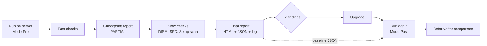
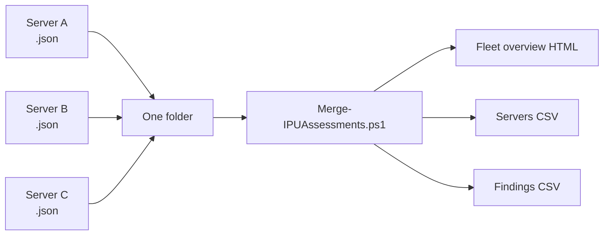
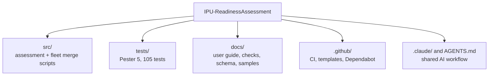

# IPU-ReadinessAssessment

Read-only **in-place upgrade (IPU) readiness assessment** for Windows Server. Run it on a server
before an upgrade to **Windows Server 2025** (default) or **2022**, and get one verdict, a prioritised
list of what to fix, and a self-contained report. Run it again afterwards to check the server against
its own pre-upgrade snapshot.

[](https://github.com/JeanKadang/IPU-ReadinessAssessment/actions/workflows/ci.yml)


## What you get

| Output | For | File |
|---|---|---|
| HTML report | People: findings, what to do, evidence | `<Computer>-IPU-Assessment.html` |
| JSON result | Tools, fleet roll-ups, post-upgrade baseline | `<Computer>-IPU-Assessment.json` |
| Log | Troubleshooting the collector | `<Computer>-IPU-Assessment.log` |
| One result line | The automation platform (OpenText SA) | stdout, semicolon-delimited |

Default output folder: `C:\Temp\IPU-Assessment`.

For many servers, `Merge-IPUAssessments.ps1` turns all the JSON results into a fleet overview:

| Output | For | File |
|---|---|---|
| Fleet overview | Whole estate at a glance, worst server first | `IPU-Fleet-Overview.html` |
| Servers sheet | One row per server, for Excel | `IPU-Fleet-Servers.csv` |
| Findings sheet | Every finding, one row each, for filtering | `IPU-Fleet-Findings.csv` |

## How it works



It answers four questions:

1. **Is the path supported?** Source release, edition and target, per Microsoft's installation-media table.
2. **Will the server and its workloads survive?** SQL, Exchange, IIS, RDS, clustering, VMware, drivers, agents, antivirus/EDR, backup, certificates, removed or deprecated features.
3. **Is Windows healthy enough?** Pending reboot, patch age, activation, disk space, DISM component store, SFC.
4. **Did anything get lost afterwards?** Services, ports, routes, IP/DNS, hosts entries, applications, features and tasks, compared with the pre-upgrade snapshot.

## Get the script

Take it from the [latest release](https://github.com/JeanKadang/IPU-ReadinessAssessment/releases/latest), not from
`main`: a release is tested in CI and has `SHA256SUMS.txt`. Before you upload the script to OpenText SA, check
that its hash matches the one in `SHA256SUMS.txt`:

```powershell
Get-FileHash .\Windows-IPU-Readiness-Assessment.ps1 -Algorithm SHA256
```

The scripts are not code-signed yet (#14). If your servers enforce signed scripts, sign them with your
organisation's certificate after checking the hash.

## Quick start

Run in an elevated session on the server (Windows PowerShell 4.0+):

```powershell
# Pre-upgrade assessment, target Windows Server 2025
.\src\Windows-IPU-Readiness-Assessment.ps1

# Target 2022 instead
.\src\Windows-IPU-Readiness-Assessment.ps1 -TargetServerVersion 2022

# After the upgrade: compare with the pre-upgrade snapshot
.\src\Windows-IPU-Readiness-Assessment.ps1 -AssessmentMode Post
```

Then open `C:\Temp\IPU-Assessment\<Computer>-IPU-Assessment.html`.

### Many servers: fleet overview

Collect each server's `.json` result into one folder, then run on an admin workstation (not on the servers):

```powershell
.\src\Merge-IPUAssessments.ps1 -InputFolder 'D:\IPU\Results'
```



Options (`-OutputFolder`, `-Mode Pre|Post|All`, `-Delimiter`) are in the [user guide](docs/user-guide.md#9-combining-many-servers-fleet-overview).

Full parameter reference, status meanings, SA usage and troubleshooting: **[User guide](docs/user-guide.md)**.
What each of the 32 checks looks at and can report: **[Checks reference](docs/checks.md)**. What a report looks like: [sample report](docs/samples/sample-report.html) (fictional server).

## Reading the result

| Status | Meaning | Counts toward overall |
|---|---|---|
| `BLOCKER` | Do not upgrade until resolved | Yes |
| `ACTION` | Must be done as part of the change | Yes |
| `WARNING` | Plan for it | Yes |
| `MANUAL` | Cannot be proven by the script; a person must check | Yes |
| `OK` | Checked, fine | No |
| `INFO` | For visibility | No |

The overall status is the most severe finding.

## Safety

The assessment is **non-remediating**. It never installs, removes or reconfigures anything.

- DISM runs `/ScanHealth` only; SFC runs `/verifyonly` only.
- `LGPO.exe` is used only with `/b` (backup) and `/parse`, never `/g` or `/m`.
- No `Win32_Product` query.
- Side effects, by design: report, log, JSON and evidence files are written. Only when `-TargetMediaPath` is set is an ISO mounted and dismounted, and Setup's compatibility scan creates `C:\$WINDOWS.~BT`.
- A crashed check is reported as `MANUAL`: absence of findings in that area is not evidence of readiness.

> Reports describe a server in detail (ports, tasks, certificates, agents). Treat them as sensitive. Folders the script creates are limited to SYSTEM and Administrators; an existing folder keeps its permissions, and the report warns if it is readable by ordinary users. Opt out with `-RestrictOutputAcl $false`.

## Repository layout



| Path | Contents |
|---|---|
| `src/` | `Windows-IPU-Readiness-Assessment.ps1` (runs on each server), `Merge-IPUAssessments.ps1` (fleet overview, runs on a workstation) |
| `tests/` | Pester tests for the decision rules and reporting |
| `docs/user-guide.md` | How to run and interpret the assessment |
| `docs/checks.md` | What every check looks at and can report |
| `docs/result-schema.md`, `docs/result-schema.json` | JSON result format (`IPU-Assessment/1`) and its JSON Schema |
| `docs/samples/` | Synthetic sample report and result, built by `build/New-SampleReport.ps1` |
| `docs/adr/` | Architecture decision records |
| `docs/review/` | Repository quality review |
| `.github/` | CI, release and labeler workflows, issue forms, PR template, Dependabot, release notes config |
| `.claude/`, `AGENTS.md`, `CLAUDE.md` | Shared GitHub workflow skills, plugin settings and assistant guidance (see [CONTRIBUTING](CONTRIBUTING.md#working-with-claude-code)) |

## Development

```powershell
# Run the tests (Pester 5)
Invoke-Pester .\tests -Output Detailed
```

Tests load the script in library mode (`IPU_ASSESSMENT_LIBRARY_ONLY=1`): functions only, nothing is collected,
so they run on any machine with PowerShell and Pester. If your machine enforces a signed-script policy, start
the session with `pwsh -ExecutionPolicy Bypass` (process scope only).

New contributor? Start with the [Git setup guide](docs/git-setup.md). Contributing workflow and conventions: [CONTRIBUTING.md](CONTRIBUTING.md). Security reports: [SECURITY.md](SECURITY.md).
Version history: [CHANGELOG.md](CHANGELOG.md).

## License

GPL-3.0. See [LICENSE](LICENSE).
