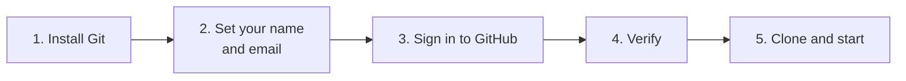

# Git setup for new contributors

Do this once on your computer, before your first commit. It takes about five minutes.



## Why this matters

Every commit records who made it, using the name and email stored in your Git settings. If they are not set, your
commits show a default or wrong name (for example `Claude`) and are not linked to your GitHub profile. History then
cannot show who did what.

## 1. Install Git

Check first. If this prints a version, skip to step 2:

```powershell
git --version
```

Otherwise install it with winget (built into Windows 11):

```powershell
winget install --id Git.Git -e --source winget
```

**Close and reopen your terminal** afterwards, so `git` is found.

## 2. Set your name and email

```powershell
git config --global user.name "Your Name"
git config --global user.email "338514510+Micker71@users.noreply.github.com"
```

Replace `Your Name` with the name you want shown on your commits.

### Which email?

| Option | Use when |
|---|---|
| GitHub **noreply** address: `<id>+<login>@users.noreply.github.com` | Recommended. Links commits to your profile without exposing your real email. Works even if GitHub's "block command line pushes that expose my email" setting is on |
| Your own email | It must be a **verified** email on your GitHub account (Settings, Emails), otherwise commits are not linked to you |

The example above is for the GitHub account `Micker71`. For another account, find your number with:

```powershell
gh api user --jq .id
```

and build the address as `<that number>+<your login>@users.noreply.github.com`.

## 3. Sign in to GitHub

Install the GitHub CLI if you do not have it (`winget install --id GitHub.cli -e`), then:

```powershell
gh auth login
```

Choose **GitHub.com**, **HTTPS**, and sign in with the browser. This lets `git push` and `gh` act as you.

## 4. Verify

```powershell
git config --global user.name
git config --global user.email
gh auth status
```

You should see your name, your email, and `Logged in to github.com account <your login>`.

After your first commit, check the author:

```powershell
git log -1 --format="%an <%ae>"
```

## 5. Clone and start

```powershell
git clone https://github.com/JeanKadang/IPU-ReadinessAssessment.git
cd IPU-ReadinessAssessment
```

Then read [CONTRIBUTING.md](../CONTRIBUTING.md) for the workflow: issue first, one branch per issue, pull request,
review, merge.

## Troubleshooting

| Problem | Cause | Fix |
|---|---|---|
| `git` is not recognised after install | The terminal was opened before the install finished | Close and reopen the terminal |
| New commits still show the wrong name | A repository-level setting overrides the global one | In the repo: `git config --local --list`. Remove with `git config --local --unset user.name` and `git config --local --unset user.email` |
| Push rejected: "email privacy" | Your commit used a private email | Use the noreply address in step 2, then `git commit --amend --reset-author --no-edit` for the last commit only |
| Commits are not linked to your profile | The email is not verified on your account | Use the noreply address, or verify the email on GitHub |
| `gh auth login` fails | Browser sign-in was cancelled or blocked | Run it again and choose the one-time code option |
| Old commits show the wrong name | Commits already made are not changed by new settings | Leave them. Only new commits use your settings. Rewriting shared history is not worth it |

> Do not use `--global` settings to hold secrets. Name and email are public in every commit.
