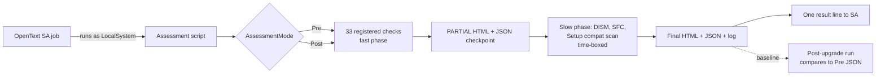
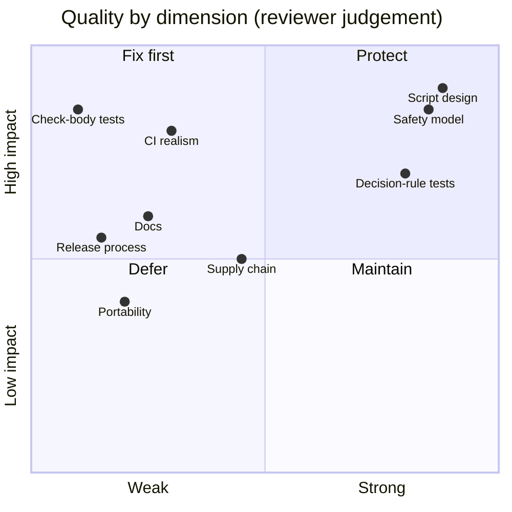
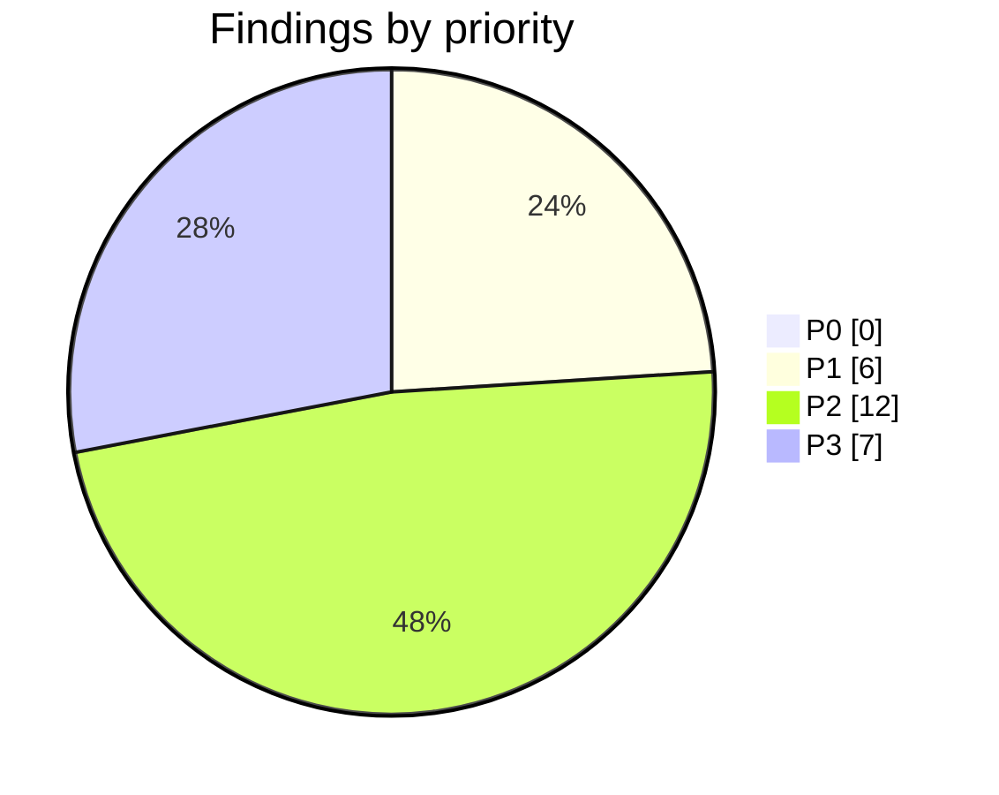
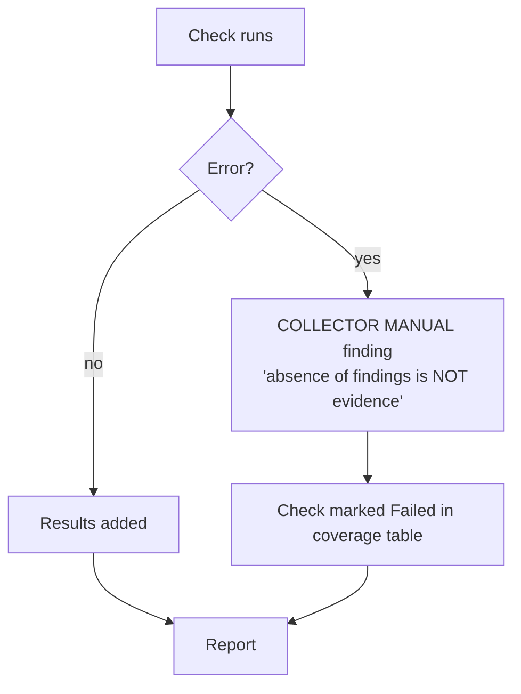
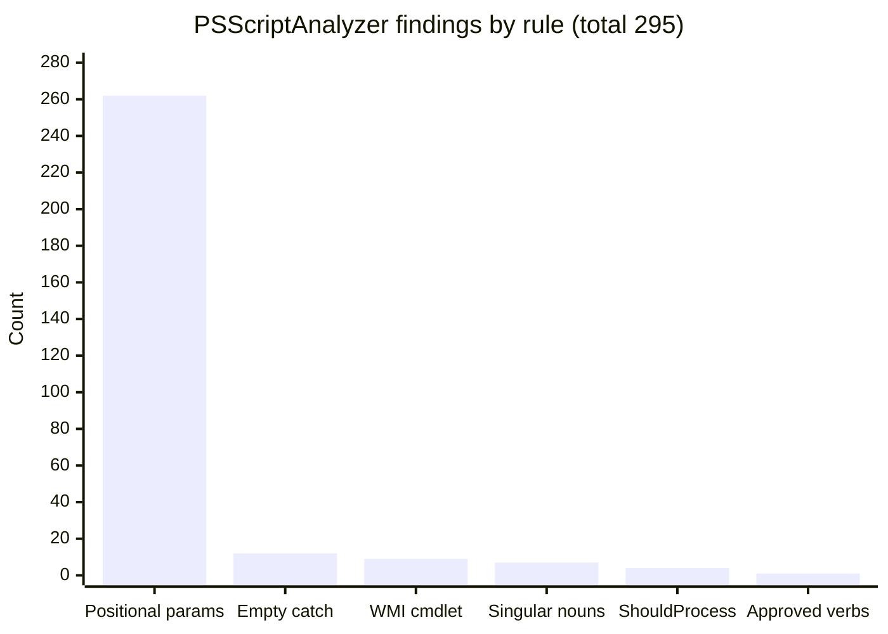
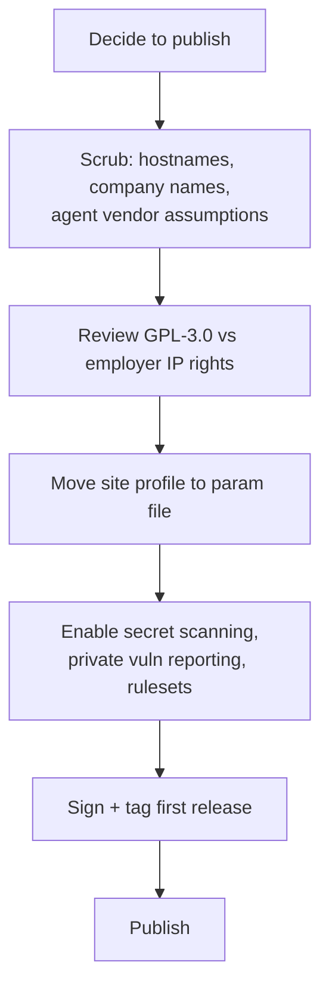
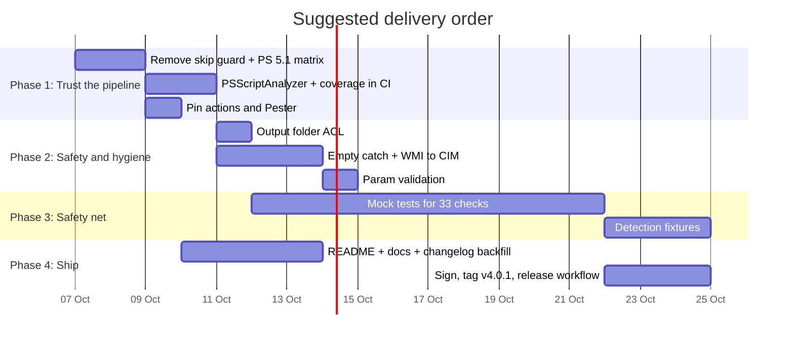
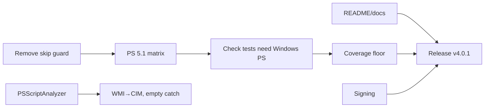

# Repository Audit Review: IPU-ReadinessAssessment

| | |
|---|---|
| **Reviewed** | 2026-10-06, `main` at merge of PR #8 |
| **Scope** | Entire repository: script, tests, CI, docs, GitHub settings |
| **Method** | Full read of the script header, parameters, core, report and main sections; static parse; PSScriptAnalyzer run; Pester run (local and CI); GitHub API audit of settings |
| **Author** | Claude (Sonnet 5.5) |
| **Prior reviews** | None existed in `docs/review/`; none consulted |

Evidence labels: **CONFIRMED** = verified by running something. **PLAUSIBLE** = from reading code, not exercised.

---

## 1. What this repository is

A single PowerShell script, `src/Windows-IPU-Readiness-Assessment.ps1` (v4.0.1, 2,713 lines), that
assesses a **Windows Server 2012 R2+** host before an **in-place upgrade (IPU)** to Server 2025 or 2022.
It is read-only, runs on the server (designed for OpenText Server Automation as LocalSystem), and writes:

- a self-contained **HTML report** for people,
- a **JSON result** for tools and as the baseline for a post-upgrade comparison,
- a **log**, and one **semicolon-delimited line** on stdout for the automation platform.



### Repository layout today

```
.
├── .github/
│   ├── ISSUE_TEMPLATE/   bug_report.yml, feature_request.yml, config.yml
│   ├── workflows/ci.yml  Pester on windows-latest (pwsh)
│   ├── dependabot.yml    github-actions, weekly
│   ├── release.yml       label → release-note sections
│   └── pull_request_template.md
├── docs/review/          this document
├── src/Windows-IPU-Readiness-Assessment.ps1
├── tests/Windows-IPU-Readiness-Assessment.Tests.ps1   (105 tests)
├── CHANGELOG.md  CONTRIBUTING.md  SECURITY.md  README.md  LICENSE (GPL-3.0)
└── .editorconfig  .gitattributes  .gitignore
```

### Script architecture

| Section | Lines | Role | Test coverage |
|---|---|---|---|
| 1 Parameters | 108-160 | 30 params with defaults | none |
| 2 Detection patterns | 163-229 | Regex tables for agents, AV/EDR, backup, workloads | indirect (replay test) |
| 3 Core | 231-654 | Result model, check runner, native-command capture | partial |
| 4 Decision rules | 656-1000 | **Pure functions**, no system access | **good** |
| 5 Checks | 1002-2310 | 33 `Register-Check` blocks | **none** |
| 6 Report | 2311-2620 | HTML, JSON, post comparison | partial |
| 7 Main | 2623-2713 | Orchestration, 32-bit relaunch | none |

---

## 2. Verdict



**Strong engineering core, thin delivery wrapper.** The script is unusually disciplined for an
operations script: pure decision functions with tests, time-boxed slow checks, a checkpoint report so a
killed job still leaves evidence, and an honest failure model (a crashed check reports MANUAL with
"absence of findings is NOT evidence of readiness"). The weak spots are around it: CI does not run
the code the way production does, the 33 checks that touch the machine are untested, and the repo
carries almost no user documentation or release process.

### Confirmed facts

| Fact | Evidence |
|---|---|
| Script parses with 0 errors | PowerShell AST parse |
| 105 / 105 Pester tests pass, locally and in CI | PR #8, run 37451096324 |
| PSScriptAnalyzer: **295 findings**, 0 errors | see §4.4 |
| Only pure functions are tested; **30 of 53 functions** and all 33 check bodies have no test | grep of function names in tests |
| CI runs under `pwsh` (7.x), not Windows PowerShell | `ci.yml` `shell: pwsh` |
| Script is ASCII-only, CRLF, no BOM | `file`, grep |
| No secrets, tokens, keys or email addresses | pattern scan |

---

## 3. Findings by priority

Priority model: **P0** broken/unsafe, **P1** important quality/reliability/security, **P2** valuable
improvement, **P3** polish. Nothing here is P0.



### P1: important

| # | Finding | Evidence | Why it matters | Fix |
|---|---|---|---|---|
| P1-1 | **CI never runs Windows PowerShell 5.1 / 4.0**, the actual target (`#requires -Version 4.0`, run by SA) | `ci.yml`: `shell: pwsh`; script header line 10 | A 5.1-only break (or a PS 7-only construct slipping in) ships green. CONFIRMED by config | Matrix `shell: powershell` (5.1) and `pwsh`. Add a PS 4 syntax guard via `Parser` with `-Version` awareness |
| P1-2 | **CI "skip if script missing" guard** now hides failures | `ci.yml` step 1 | If the path is renamed, CI exits 0 with only a warning. CONFIRMED | Remove the guard (script exists now) |
| P1-3 | **33 checks untested.** All collection logic (registry, WMI, services, certificates, RDP, storage) has zero automated coverage | Test file has no `Register-AssessmentChecks` references | The hard part to get right is the part with no net. PLAUSIBLE risk, CONFIRMED gap | Introduce Pester mocks over `Get-WmiSafe`, `Get-RegistryValueSafe`, `Invoke-NativeCapture`; one test per check asserting expected results for a canned machine |
| P1-4 | **Report output is written to `C:\Temp\IPU-Assessment` with inherited ACLs** | Param `ReportDirectory`; no `Set-Acl`/`icacls` anywhere | The report lists listening ports, scheduled tasks, certificates, drivers, AV/EDR product versions: a recon map. Default `C:\Temp` is typically readable by Users. PLAUSIBLE | Create the folder with an ACL for SYSTEM + Administrators only; document it |
| P1-5 | **Script is unsigned**; this machine's policy refused it (`not digitally signed`) | Local Pester run before bypass | Any AllSigned estate cannot run it, and users are pushed towards blanket `Bypass`. CONFIRMED | Authenticode-sign releases; publish the hash in release notes |
| P1-6 | **Referenced companion script missing**: `Merge-IPUAssessments.ps1` | Script line 2545 comment | The JSON feature is described as feeding a fleet overview that does not exist in the repo | Add it to `src/`, or reword the comment |

### P2: valuable

| # | Finding | Evidence | Fix |
|---|---|---|---|
| P2-1 | 12 **empty `catch {}`** blocks and 49 `-ErrorAction SilentlyContinue` | PSSA `PSAvoidUsingEmptyCatchBlock` | A `Write-Swallowed` helper already exists; route every empty catch through it so nothing is silent |
| P2-2 | **9 `Get-WmiObject` uses** (`PSAvoidUsingWMICmdlet`) | PSSA | `Get-CimInstance` exists since PS 3.0, so it is safe for the PS 4.0 floor and works on PS 7 |
| P2-3 | **262 positional-parameter uses** | PSSA | Low risk; fix opportunistically, suppress the rule in settings |
| P2-4 | `Normalize-Thumbprint` uses an unapproved verb | PSSA `PSUseApprovedVerbs` | Rename `ConvertTo-NormalizedThumbprint` |
| P2-5 | No **PSScriptAnalyzer step in CI** | `ci.yml` | Add with a `PSScriptAnalyzerSettings.psd1` that records accepted suppressions |
| P2-6 | **No coverage measurement** | `ci.yml` | `-CodeCoverage src/*.ps1` and publish the number; set a floor once check tests exist |
| P2-7 | **Company-specific content** is baked into a general repo: company name in the `agents` check name, OpenText agent patterns, `da-DK` number culture, `C:\Temp\Tools\LGPO.exe`, a test replaying a real host (removed in #17) | Script lines 9, 158, 173-175, 1740; tests line 280 | Fine while private. Before any public release: genericise, or move site profile into a parameter file. See §5 |
| P2-8 | **No release or tag.** Version 4.0.1 only lives in the script header and `$script:CollectorVersion`; `CHANGELOG.md` says only "Unreleased" | Repo has no tags | Backfill 4.0.0/4.0.1 from the script's own history into the changelog; tag `v4.0.1` |
| P2-9 | **README is minimal**: no parameter table, no output description, no example result, no SA instructions, no safety summary | `README.md` | See §6 documentation plan |
| P2-10 | **Version drift risk**: the version appears in 2 places in the script plus the tests header | grep | A test asserting header version equals `$script:CollectorVersion` |
| P2-11 | **Parameters lack range validation** (`MinimumCFreeGB`, timeouts, thresholds accept negatives/zero) | Param block | `[ValidateRange()]` on ints; `[ValidateScript]` for paths |
| P2-12 | **Actions not pinned to commit SHAs**; Pester installed unpinned (`-MinimumVersion 5.0`) | `ci.yml` | Pin `actions/checkout` by SHA (Dependabot will keep it fresh) and pin a Pester version |

### P3: polish

| # | Finding | Fix |
|---|---|---|
| P3-1 | 7 plural-noun function names (`PSUseSingularNouns`) | Rename or suppress |
| P3-2 | 4 state-changing functions without `ShouldProcess` | Suppress with justification (they only write report files) |
| P3-3 | HTML table lacks `<caption>` and `scope="col"` on `<th>` | Add; improves screen-reader navigation |
| P3-4 | Checklist checkbox is a glyph (`&#x2610;`) not a real control | Fine for print; add `aria-hidden` and a visible text status |
| P3-5 | No visible `:focus` style for `<summary>` | Add outline rule |
| P3-6 | No `prefers-color-scheme` handling | Optional dark theme |
| P3-7 | History comment still says "ChatGPT-based edition" (v3.5.0) | Keep as history, or reword to neutral |

### Things that are good (protect these)

- **Non-remediating by design**, documented in `.SAFETY` and consistent with the code: no `Win32_Product`, no installs, LGPO only `/b` and `/parse`.
- **Honest failure model**: every check runs under `$ErrorActionPreference='Stop'`; failure becomes a visible MANUAL finding.
- **Time-boxing and checkpointing**: slow checks share one budget; a PARTIAL report is written first.
- **Atomic writes**: `.writing` temp file then `Move-Item`, plus an HTML sanity check before publishing.
- **HTML output is encoded** via `WebUtility.HtmlEncode` on every interpolated value; self-contained, no external requests. Badge colours pass WCAG AA against white text (reviewer estimate; not measured with a tool).
- **32-bit host relaunch** avoids the silent Wow6432Node wrong-answer trap, and passes bound parameters through typed.
- **Native output decoding** handles UTF-16LE vs OEM code pages.
- **Pure decision rules** with table-driven tests (upgrade paths, editions, SQL matrix, VMware Tools).

---

## 4. Detailed review

### 4.1 Script safety and correctness



- **Strengths:** described above. The design makes a wrong "all clear" hard.
- **Gap (PLAUSIBLE):** `Invoke-NativeCapture` reads output files after a timeout kill; a killed `dism.exe` can leave partial output that `Get-DismVerdict` might parse. A test with truncated output would settle it.
- **Gap (PLAUSIBLE):** the relaunch builds a command string and passes it to `powershell.exe -Command`. Parameters are quoted and single quotes doubled, which is correct for the current types (string/int/bool). A future `[switch]`, `[double]` or array parameter would silently mis-pass. Add a test that every param type is handled, or fail loudly on unknown types.
- **Side effects** are documented and limited to report/log/JSON/evidence files, an ISO mount when media is set, and Setup creating `C:\$WINDOWS.~BT`.

### 4.2 Tests

| Area | Tests | Notes |
|---|---|---|
| Release mapping, upgrade path, edition, language | many, table-driven | Good |
| SQL / VMware / feature lifecycle / compat scan decisions | yes | Good |
| DISM / SFC / VSS verdict parsing | yes | Good; add truncated-output cases |
| Result model, runner, overall status | yes | Good |
| HTML + JSON output | yes | Add a golden-file or structural test of the HTML |
| Post-upgrade comparison | yes | Good |
| **Check bodies (33)** | **none** | See P1-3 |
| **Main / relaunch** | **none** | Test with `IPU_ASSESSMENT_LIBRARY_ONLY` plus a stubbed `Invoke-Check` |
| Detection patterns | one replay test of one real host | Add one fixture per vendor row (about 30) |

The replay test names a real host. Replace with a synthetic fixture before any public release.

### 4.3 CI/CD and supply chain

| Item | State | Recommendation |
|---|---|---|
| Triggers | PR + push to main | Good |
| Permissions | `contents: read` explicit | Good |
| Runner | `windows-latest`, `pwsh` only | Matrix with 5.1 (P1-1) |
| Action pinning | tag (`@v4`) | Pin by SHA (P2-12) |
| Dependency updates | Dependabot weekly, Actions | Good. PR #6 (checkout 4 → 7) is open |
| Lint | none | Add PSScriptAnalyzer (P2-5) |
| Coverage | none | P2-6 |
| Release automation | none | Tag-triggered workflow that builds a zip, hashes it, signs if a cert is available |
| Branch protection | **unavailable** (free private plan returns 403) | Constraint, not defect. Merge discipline is the only control |

### 4.4 Static analysis (CONFIRMED)



No errors. 262 of 295 are informational. The 12 empty catches and 9 WMI calls are the ones worth fixing.

### 4.5 Generated report (HTML) accessibility

| Check | Result |
|---|---|
| `<html lang="en">`, charset, viewport | Present |
| Colour not the only signal | Badges carry text labels |
| Contrast | Looks AA for badges and body (estimated, not measured) |
| Keyboard | `<details>/<summary>` natively focusable; no visible focus style (P3-5) |
| Table semantics | No `caption`, no `scope` (P3-3) |
| Responsive / print | Handled (`@media` for 900px and print) |
| Self-contained | Yes, inline CSS, no network |

### 4.6 Repository and GitHub settings (API audit)

| Setting | Actual | Verdict |
|---|---|---|
| Visibility | private | n/a |
| Issues / Projects / Wiki | on / on / off | Good; board exists, wiki off |
| Delete branch on merge | on | Good |
| Merge methods | merge, squash, rebase all allowed | Convention is merge commits; consider disabling the others |
| Actions token | read-only; cannot approve PRs | Good |
| Rulesets | unavailable (plan) | Constraint |
| Secret scanning, private vuln reporting | unavailable (plan) | Constraint; `SECURITY.md` says so honestly |
| Collaborators | one invite pending (Write) | Add CODEOWNERS on acceptance |

---

## 5. Public-release readiness

If this ever becomes public, work through this gate first.



- **Licence question (needs a human decision):** GPL-3.0 is copyleft. If the script was written for an employer or contains employer-specific logic, check ownership before choosing any licence. Not a technical finding.
- A public repo also unlocks rulesets and secret scanning on the free plan.

---

## 6. Improvement catalogue

Every variation considered, grouped by theme. Effort: S ≤ half day, M ≤ 2 days, L > 2 days.

### 6.1 Quality and testing

| Idea | Effort | Impact |
|---|---|---|
| Mock-driven tests for all 33 checks (P1-3) | L | High |
| PSScriptAnalyzer in CI with settings file | S | Medium |
| Code coverage report + floor | S | Medium |
| One detection-pattern fixture per vendor | M | Medium |
| Truncated/hostile native-output tests | S | Medium |
| Version-consistency test | S | Low |
| Golden-file test of HTML structure | M | Low |
| Mutation testing of decision rules | L | Low |

### 6.2 CI/CD

| Idea | Effort | Impact |
|---|---|---|
| Matrix: Windows PowerShell 5.1 + pwsh 7 (P1-1) | S | High |
| Remove skip guard (P1-2) | S | High |
| Windows Server 2019/2022 runners for realistic smoke run | M | Medium |
| Smoke job: actually run the script on the runner and validate the JSON schema | M | High |
| Pin actions by SHA; pin Pester | S | Medium |
| Tag-triggered release workflow producing a signed zip | M | High |
| Scheduled weekly run to catch OS-image drift | S | Low |

### 6.3 Security

| Idea | Effort | Impact |
|---|---|---|
| Restrictive ACL on output folders (P1-4) | S | High |
| Authenticode signing + published hash (P1-5) | M | High |
| Option to redact hostnames/IPs in the HTML | M | Medium |
| JSON schema file (`IPU-Assessment/1`) in `docs/` with validation in CI | M | Medium |
| Public: secret scanning, private reporting | S | High, plan-dependent |

### 6.4 Code health

| Idea | Effort | Impact |
|---|---|---|
| Replace WMI with CIM (P2-2) | S | Medium |
| Eliminate empty catches via `Write-Swallowed` (P2-1) | S | Medium |
| `ValidateRange`/`ValidateScript` on params (P2-11) | S | Medium |
| Split script into a module (`.psm1` + private/public functions) with the script as thin entry point | L | High long term, but conflicts with the "single file runs from SA ad-hoc" requirement. **Decision needed** |
| Externalise detection patterns to a `.psd1`/JSON data file | M | Medium |
| Externalise site policy (thresholds, culture, paths) to a profile file | M | Medium |

### 6.5 Documentation

| Idea | Effort | Impact |
|---|---|---|
| README: purpose, requirements, parameters table, outputs, exit codes, example | S | High |
| `docs/usage-sa.md`: running from SA, timeouts, retrieving reports | S | High |
| `docs/checks.md`: each of the 33 checks, what it reads, what status means | M | High |
| `docs/result-schema.md` + JSON schema | S | Medium |
| `docs/adr/`: record decisions (single file, DC blocked by policy, 2022 vs 2025 targets) | S | Medium |
| Sample report (synthetic) committed as an HTML artifact | S | Medium |
| Diátaxis split: tutorial / how-to / reference / explanation | M | Medium |

Suggested docs layout:

```
docs/
├── usage-sa.md
├── checks.md            reference, generated from Register-Check blocks
├── result-schema.md
├── adr/0001-single-file-script.md
├── samples/sample-report.html   (synthetic host)
└── review/audit-review-Claude.md
```

### 6.6 Release and governance

| Idea | Effort | Impact |
|---|---|---|
| Backfill changelog 4.0.0 / 4.0.1; tag `v4.0.1` (P2-8) | S | Medium |
| CODEOWNERS once collaborator accepts | S | Medium |
| Disable squash/rebase merges to match convention | S | Low |
| Labels for PR categories applied by a labeler action | S | Low |
| Project board automation (web UI only) | S | Medium |
| Reject blank issues is already on; add `config.yml` contact link | S | Low |

---

## 7. Roadmap



### Dependency map



### Suggested milestones

Reuse the existing scheme (`v0.1.0 Bootstrap` is closed-out work). Proposed next:
**v4.1.0 CI & safety** (Phase 1 + 2 + docs), **v4.2.0 Test coverage** (Phase 3). Priority stays on labels P0-P3, not milestones.

---

## 8. Decisions needed from the maintainer

1. **Module vs single file.** The single file suits SA ad-hoc execution. A module is cleaner but breaks that. Recommendation: keep one file, generate it from modules at release time (build step) if size becomes a problem.
2. **Public or private long term?** Drives §5 and several plan-gated protections.
3. **Signing certificate availability.** Without one, P1-5 cannot be closed.
4. **Where does `Merge-IPUAssessments.ps1` live?** In this repo, another repo, or nowhere (P1-6).
5. **Licence and ownership** (§5).

## 9. Deliberately not recommended

| Idea | Why not |
|---|---|
| Rewriting in C# or Python | The target hosts have only Windows PowerShell; the dependency-free single file is the feature |
| Auto-remediation | Contradicts the read-only safety contract that makes the tool safe to run from SA |
| CODEOWNERS now | Not needed until the second maintainer accepts; then yes |
| GitHub Wiki | Versioned docs belong in `docs/` |
| Branch ruleset | Not available on this plan; revisit if the repo goes public or upgrades |
| Fixing all 262 positional-parameter hits | Informational only; churn outweighs benefit |

## 10. Next step

Nothing in this review has been filed as issues. On approval, the P1 items plus the grouped P2
hygiene fixes would become roughly 9 issues (under the 10-issue confirmation threshold), assigned
and added to the board.
