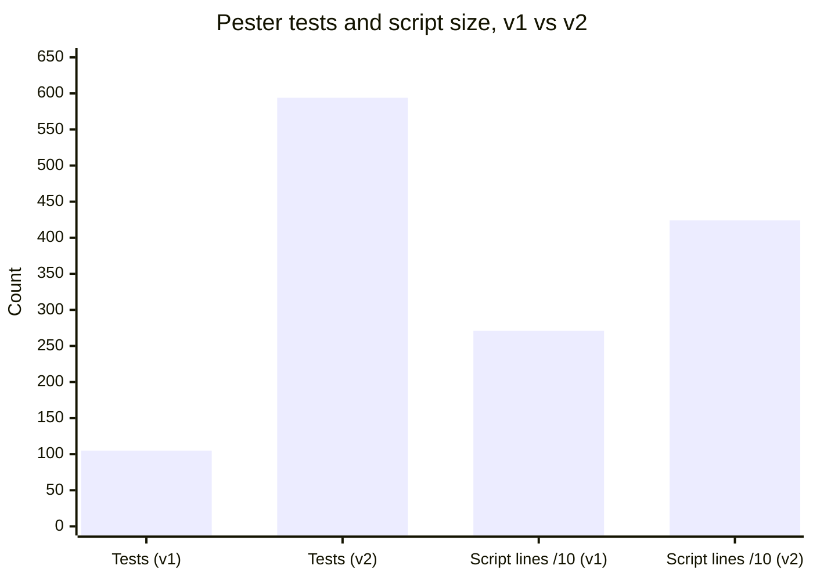
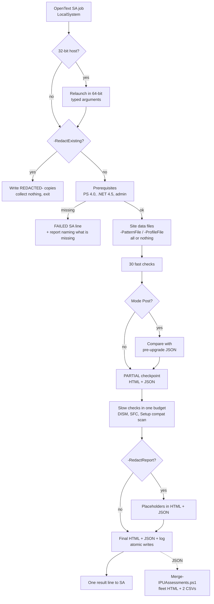
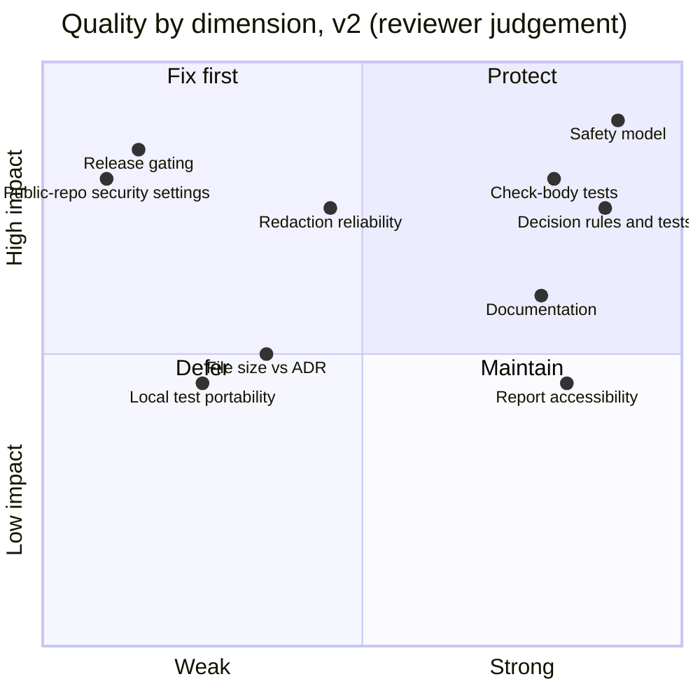
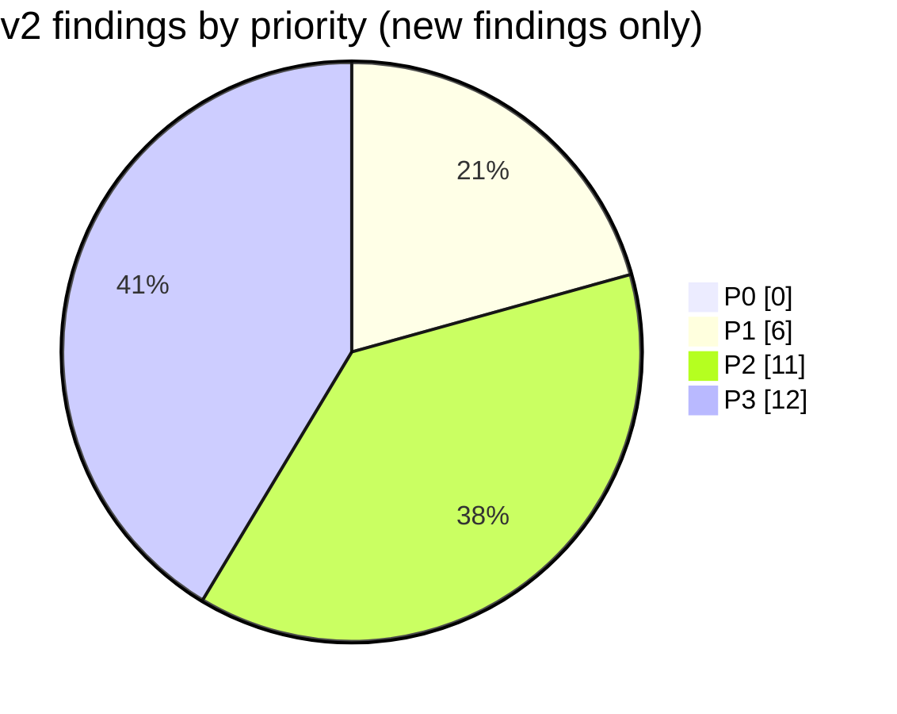
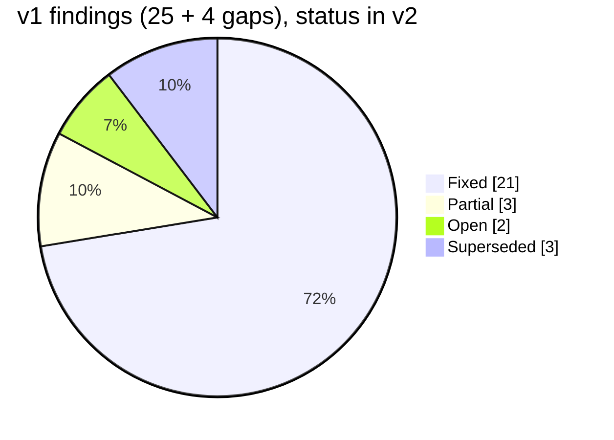
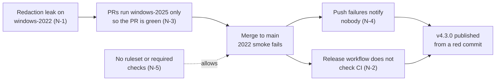
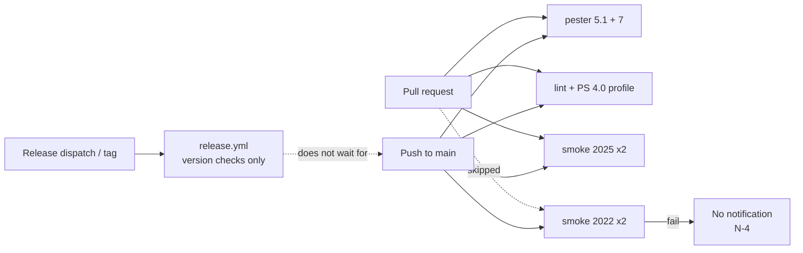
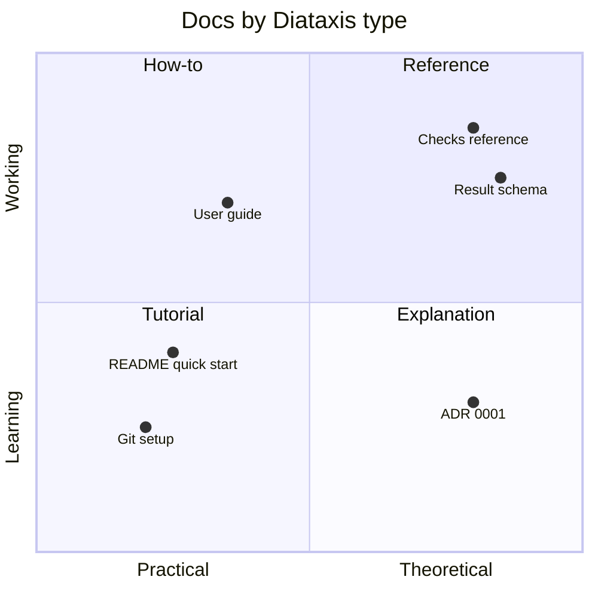
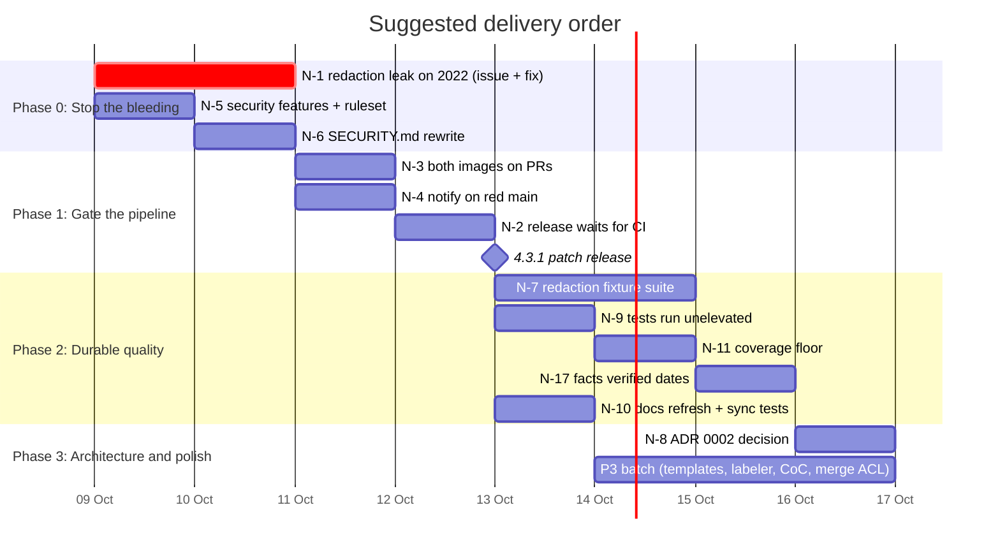
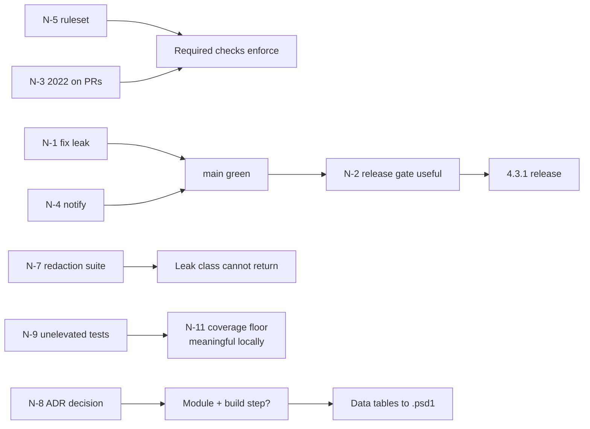

# Repository Audit Review v2: IPU-ReadinessAssessment

| | |
|---|---|
| **Reviewed** | 2026-10-08 |
| **Code state** | Local `main` at `104a134` (one unpushed commit ahead of `origin/main` at `994d5be`, the v4.3.0 release merge) |
| **Scope** | Entire repository: both scripts, three test files, build scripts, CI/release workflows, docs, governance files, AI-assistant files, live GitHub settings |
| **Method** | Read of the script header, parameters, core, redaction, report, main and selected checks; read of every workflow, build script, doc and governance file; Pester run locally (unelevated, da-DK culture); CI logs of the last runs on `main`; GitHub API audit of settings, security features, issues, milestones and releases; grep sweeps for the hard rules |
| **Author** | Claude (Opus 5.5) |
| **Relation to v1** | Written independently. The v1 review (`audit-review-Claude.md`, 2026-10-06) was read **only** to reconcile its findings in [section 3](#3-v1-findings-reconciled). Nothing else was carried over. |

Evidence labels: **CONFIRMED** = verified by running something or reading live state (API, CI log). **PLAUSIBLE** = from reading code, not exercised.

> **Security note.** In line with `SECURITY.md` and the AGENTS.md hard rule, security-sensitive items, if any, are
> handled privately with the maintainers and are not part of this public document.

---

## Contents

1. [What the repository is today](#1-what-the-repository-is-today)
2. [Verdict](#2-verdict)
3. [v1 findings reconciled](#3-v1-findings-reconciled)
4. [New findings](#4-new-findings)
5. [Detailed review by area](#5-detailed-review-by-area)
6. [Improvement catalogue](#6-improvement-catalogue)
7. [Roadmap](#7-roadmap)
8. [Decisions needed from the maintainers](#8-decisions-needed-from-the-maintainers)
9. [Deliberately not recommended](#9-deliberately-not-recommended)
10. [Follow-up](#10-follow-up-2026-10-08)

---

## 1. What the repository is today

A read-only **Windows Server in-place upgrade (IPU) readiness assessment**. One PowerShell file runs on each
server (designed for OpenText Server Automation as LocalSystem, Windows PowerShell 4.0+), assesses it against a
2025 or 2022 target, and writes a self-contained HTML report, a JSON result, a log and one semicolon-delimited
line for the automation platform. A second script merges many JSON results into a fleet overview on a workstation.
After the upgrade the same script runs in `Post` mode and compares the server with its own pre-upgrade snapshot.

### Growth since v1 (two days)

| Metric | v1 (2026-10-06) | v2 (2026-10-08) | Change |
|---|---:|---:|---|
| Assessment script version | 4.0.1 | 4.3.0 | 3 tagged releases |
| Assessment script lines | 2,713 | 4,243 | +56 % |
| Functions in the assessment script | 53 | 105 | ×2 |
| Registered checks | 31 (v1 stated 33) | 33 | `grouppolicy` (4.2.0) and `fileshares` (4.3.0) added |
| Pester tests (CI) | 105 | 594 | ×5.7 |
| Code coverage of `src/*.ps1` (CI, PowerShell 7) | not measured | **90.0 %** of 5,688 commands | new |
| PSScriptAnalyzer gate | none | fails on any warning, plus a PowerShell 4.0 compatibility profile | new |
| CI jobs on `main` | 1 | 7 (2 × pester, 4 × smoke, lint) + notify | new |
| Releases | none | v4.1.0, v4.2.0, v4.3.0 with `SHA256SUMS.txt` | new |
| Visibility | private | **public** | changes several v1 verdicts |

### How it runs now

### Repository map

| Path | Role | Quality signal |
|---|---|---|
| `src/Windows-IPU-Readiness-Assessment.ps1` | The assessment (7 numbered sections) | Strong; see §5.1 |
| `src/Merge-IPUAssessments.ps1` | Fleet roll-up, 174 lines | Good; CSV-injection safe, redacted-result aware |
| `tests/` | 3 Pester files, 594 tests (fake-server check tests, decision rules, report, merge) | Strong in CI, not hermetic locally (N-9) |
| `build/` | CI test runner, lint runner, end-to-end smoke test, sample generator | Good; annotations and job summaries |
| `docs/` | User guide (638 lines), checks reference, JSON schema + description, ADR, samples, git setup | Good; some stale numbers (N-10) |
| `.github/` | CI, release, labeler workflows, issue forms, PR template, Dependabot, CODEOWNERS, release notes config | Good; gating gaps (N-1 to N-4) |
| `.claude/`, `.agents/`, `AGENTS.md`, `CLAUDE.md` | Shared AI workflow skills and guidance | Useful; duplicated (N-14) |

---

## 2. Verdict

**The engineering core went from "strong" to "excellent"; the delivery controls did not keep up with the move to a
public repository.** In two days almost every v1 finding was closed with evidence: check bodies are tested against a
fake server, coverage is 90 %, CI runs Windows PowerShell 5.1 and 7 with a PowerShell 4.0 static profile, actions
are SHA-pinned, releases carry hashes, the report is accessible and redactable.

The weak spot is now the **path from a merge to a release**, plus the security settings a public repository should
have switched on. The clearest symptom: `main` has been red on two consecutive pushes, and **v4.3.0 was released
from a commit whose CI run failed**. Nothing in the process stopped it or told anyone.

### Scorecard

| Dimension | v1 | v2 | Trend |
|---|:---:|:---:|:---:|
| Script design and safety model | A | A | = |
| Automated tests | C | A- | ▲▲ |
| CI realism (target shells, real runs) | D | B+ | ▲▲ |
| Static analysis | – | A | ▲▲ |
| Release process | F | C | ▲ (exists, but not gated) |
| Supply chain | C | B | ▲ (pinned; no signing, no provenance) |
| Repository security settings | n/a (private) | D | ▼ (public, features off) |
| Documentation | D | A- | ▲▲ |
| Governance and hygiene | C | B- | ▲ (two lapses, see N-13, N-14) |

### Confirmed facts

| Fact | Evidence |
|---|---|
| 594 / 594 tests pass on PowerShell 7; 593 + 1 skipped on Windows PowerShell 5.1 | CI run 37779146002, `pester` jobs |
| Code coverage 90.0 % of 5,688 commands in `src/*.ps1` | Same run, coverage notice |
| `main` CI **failed** on the last two pushes (#110 merge, #113 merge) | Runs 37776700619, 37779146002: `smoke (*, windows-2022)` fail |
| The failure is the redaction leak check: *"leaked 1"* of the runner's service and task account names | Smoke log, both shells |
| Release v4.3.0 started 1 s after the CI run on the same commit and succeeded in 14 s | Run 37779147741 (Release) vs 37779146002 (CI), same `headSha` |
| Repository is public; secret scanning, push protection, private vulnerability reporting and Dependabot alerts are **disabled**; no ruleset, no branch protection | `gh api repos/{owner}/{repo}` and related endpoints |
| No `Get-WmiObject`, no empty `catch {}`, no `Win32_Product` query, no state-changing cmdlet beyond the documented side effects | grep sweep (§5.1) |
| Local unelevated run: 182 pass / 412 fail; all failures begin right after the output-folder ACL tests | Local Pester 5.7.1, PowerShell 7, da-DK |

---

## 3. v1 findings reconciled

Every v1 finding, with its status today and the evidence. **Fixed** = closed with evidence. **Partial** = some of it
done. **Open** = not started. **Superseded** = replaced by a deliberate, recorded decision.

### v1 P1 items

| v1 ID | v1 finding | Status | Evidence today | Residual |
|---|---|---|---|---|
| P1-1 | CI never ran Windows PowerShell 5.1 / 4.0 | **Fixed** | `ci.yml` matrix `powershell` + `pwsh` for pester and smoke; `PSScriptAnalyzerSettings.PS4.psd1` checks `src/` against the Server 2012 R2 / PS 4.0 profile (#94) | PS 4.0 is checked statically only; no runtime test on 4.0 (N-15) |
| P1-2 | "Skip if script missing" guard hid failures | **Fixed** | `build/Invoke-CiTests.ps1` now errors and exits 1 when the script is missing | – |
| P1-3 | 33 check bodies untested | **Fixed** | `tests/Checks.Tests.ps1`: 119 tests against a fake server; a test asserts every check has a `docs/checks.md` entry | Fake server needs admin rights locally (N-9) |
| P1-4 | Output folder had inherited ACL | **Fixed** | `Initialize-OutputFolder` restricts folders it creates to SYSTEM + Administrators; report warns when an existing folder is readable by Users (#12) | Create-then-restrict window (N-27) |
| P1-5 | Script unsigned | **Open** | #14 open, no milestone; README and release notes say so honestly | See N-20 |
| P1-6 | `Merge-IPUAssessments.ps1` missing | **Fixed** | `src/Merge-IPUAssessments.ps1` 1.0.4 with 18 tests | Output ACL (N-12) |

### v1 P2 items

| v1 ID | v1 finding | Status | Evidence today |
|---|---|---|---|
| P2-1 | 12 empty `catch {}` | **Fixed** | 0 found; ignored failures go through `Write-Swallowed`. `SilentlyContinue` down from 49 to 37 |
| P2-2 | 9 `Get-WmiObject` | **Fixed** | 0 found; `Get-CimRequired` / `Get-CimSafe` (#18) |
| P2-3 | 262 positional parameters | **Superseded** | Rule excluded in `PSScriptAnalyzerSettings.psd1` with a written reason |
| P2-4 | `Normalize-Thumbprint` unapproved verb | **Fixed** | `ConvertTo-NormalizedThumbprint` |
| P2-5 | No PSScriptAnalyzer in CI | **Fixed** | `lint` job, `-FailOn Warning`, annotations and job summary |
| P2-6 | No coverage measurement | **Partial** | Measured and reported (90 %), plus a "functions never executed" list. **No floor is enforced**; coverage can drop silently (N-11) |
| P2-7 | Company-specific content | **Partial** | Check renamed, a test guards tracked files (#90/#91). Remaining: #90 still open awaiting owner decisions on history; site-flavoured defaults remain (`da-DK`, `C:\Temp\Tools`, "Company policy" DC rule, Danish CSV note) (N-16) |
| P2-8 | No release or tag | **Fixed** | v4.1.0, v4.2.0, v4.3.0; release workflow checks tag = header = `CollectorVersion` = CHANGELOG | New gap: release not gated on CI (N-2) |
| P2-9 | Minimal README | **Fixed** | README with outputs, flow, quick start, statuses, safety, layout; 638-line user guide |
| P2-10 | Version drift risk | **Fixed** | Test keeps header, `$script:CollectorVersion` and CHANGELOG in step (#19) |
| P2-11 | No parameter validation | **Fixed** | `ValidateRange`, `ValidateSet`, `ValidatePattern`, rooted-path `ValidateScript` | `NumberCultureName` unvalidated (N-26) |
| P2-12 | Actions and Pester unpinned | **Fixed** | All actions pinned by SHA with version comment; Pester 5.7.1, PSScriptAnalyzer 1.23.0 pinned |

### v1 P3 items

| v1 ID | v1 finding | Status | Evidence today |
|---|---|---|---|
| P3-1 | Plural nouns | **Fixed** | Eight functions renamed (#29) |
| P3-2 | `ShouldProcess` | **Superseded** | Rule excluded with a recorded reason (functions only build strings) |
| P3-3 | Table `caption` / `scope` | **Fixed** | #28 |
| P3-4 | Checkbox glyph | **Fixed** | Reads as "open" to screen readers (#28) |
| P3-5 | No focus style | **Fixed** | #28 |
| P3-6 | No dark mode | **Fixed** | Follows system dark mode; contrast tested in both themes (#28) |
| P3-7 | "ChatGPT-based edition" in history | **Fixed** | 0 occurrences |

### v1 gaps from its detailed sections

| v1 item | Status | Evidence |
|---|---|---|
| §4.1 Relaunch would mis-pass new parameter types | **Fixed** | `ConvertTo-RelaunchArgumentText` with 8 tests (#38) |
| §4.1 Truncated DISM output after a timeout kill | **Partial** | Timeout path tested in `Checks.Tests.ps1`; no test feeds truncated DISM text to `Get-DismVerdict` |
| §4.2 One fixture per detection vendor | **Superseded** | A synthetic "renamed products" fixture covers the riskiest rows; 44 pattern rows have no per-row test (see §6.1 idea) |
| §5 Public-release gate | **Open** (the repo went public without it) | See N-5, N-6 |

---

## 4. New findings

Priority model as in the repo's skills: **P0** broken/unsafe, **P1** important quality, reliability or security,
**P2** valuable improvement, **P3** polish. Nothing is P0.

### The P1 chain: how a red commit became a release

The first four findings are one causal chain. Fixing any single link would have stopped v4.3.0 shipping red.

### P1: important

| # | Finding | Evidence | Why it matters | Fix |
|---|---|---|---|---|
| N-1 | **`main` is red: redaction leak on Windows Server 2022.** Smoke test "Redacted output has none of the runner's 2 service and task account names (leaked 1)" fails on both shells, on the last two pushes to `main`. No issue tracks it. | CONFIRMED (CI runs 37776700619, 37779146002). Whether it is a real redaction gap or a smoke-test false positive is **undetermined**: the log deliberately prints only a count | Redaction is the feature that makes a report safe to share outside the team. A leak of an account name defeats it; a false positive trains everyone to ignore a red `main` | File an issue now. Reproduce on a windows-2022 runner with a debug step that prints the leaked token's *source row* (Area/Item) or a hash, not the name. Then fix the collector (`Add-RedactionLiteral` call sites) or the smoke check. Add a unit test for the case |
| N-2 | **Release is not gated on CI.** `release.yml` says "CI must already be green" but does not check. v4.3.0 was published 1 s after its CI run started; that run failed | CONFIRMED (run timings, same `headSha`) | Users are told to take the script from the latest release because it is tested. That promise was false for v4.3.0 | Before publishing, query the CI conclusion for `$GITHUB_SHA` (`gh run list --workflow ci.yml --commit $GITHUB_SHA --json conclusion`) and fail unless it is `success`; or trigger the release from `workflow_run` on CI success. Add a release-time note in CONTRIBUTING |
| N-3 | **Pull requests skip the windows-2022 smoke jobs** to save Actions minutes (#85). The repo is now public, so that rationale no longer applies | CONFIRMED (`ci.yml` matrix expression; CONTRIBUTING "repository is private ... minutes count double") | The only image that catches N-1 runs after merge, when it is too late | Run both images on pull requests. GitHub-hosted standard runners are free for public repositories. Keep `cancel-in-progress` |
| N-4 | **A failed push to `main` notifies nobody.** The `notify` job only fires for `schedule` (and the manual test) | CONFIRMED (`ci.yml` `notify.if`) | Two red pushes went unnoticed; the next weekly run is days away | Extend the condition to `github.event_name == 'push' && github.ref == 'refs/heads/main'` |
| N-5 | **Public repository with protections switched off.** Secret scanning, push protection, private vulnerability reporting, Dependabot alerts and security updates are disabled; no ruleset, no branch protection | CONFIRMED (API: `security_and_analysis` all `disabled`, `private-vulnerability-reporting` `enabled:false`, rulesets `[]`, branch protection 404) | v1 rightly called these "a constraint of the plan". Since the repo became public they are free, so they are now a defect. Without a ruleset, required checks are advisory and N-2/N-3 cannot be enforced | Enable all five features. Add a ruleset on `main`: require PR, require the PR-run job names (`pester (*)`, `smoke (*, windows-2025)`, `smoke (*, windows-2022)` once N-3 lands, `lint (PSScriptAnalyzer)`), block force-push and deletion |
| N-6 | **`SECURITY.md` is wrong.** It says the repository is private, that private reporting is unavailable, and that no tagged release exists | CONFIRMED (file vs live state) | A reporter is sent to the wrong channel; "only `main` is supported" contradicts the README's "take the latest release" | Rewrite: point to *Report a vulnerability* (after N-5), list supported versions (latest minor), state response expectations. AGENTS.md "Branch protection is not available on this plan" also needs updating |

### P2: valuable

| # | Finding | Evidence | Fix |
|---|---|---|---|
| N-7 | **Redaction has no negative fixture suite.** The leak checks live only in the smoke test, which depends on what the runner image happens to have | Smoke test `build/Invoke-SmokeTest.ps1` lines with `#100`; unit tests cover patterns, not "everything collected is replaced" | Build a synthetic "worst case" result (every collected name kind: service/task accounts with and without domain, GPO, WMI filter, share names and descriptions, OU path, UPN, IPv6, MAC) and assert that no input literal survives `Protect-ReportText`/`Protect-ReportObject`. Property-style: generate names, assert absence |
| N-8 | **ADR 0001's own revisit trigger has fired.** The ADR says to revisit "if the file passes roughly 4,000 lines". It is 4,243 | CONFIRMED (`wc -l`; ADR text) | The hard rule forbids splitting without a new ADR, so this is a **decision**, not a refactor. See §8 |
| N-9 | **Tests are not portable to an unelevated workstation.** Local run: 182 pass / 412 fail. In both large files the failures begin immediately after the tests that create restricted (SYSTEM + Administrators) folders under `TestDrive`; afterwards every test fails with an empty message | CONFIRMED (local run); cause PLAUSIBLE: the unelevated user is locked out of folders the tests restricted, and `TestDrive` handling breaks for the rest of the container | README and AGENTS.md say the tests "run on any machine". A new contributor's first run is a wall of red. Either tag those tests (`-Tag Elevated`, skip when not admin) or create the restricted ACL with the current user included in tests (inject the SID list), and clean up with `takeown`-free logic |
| N-10 | **Stale facts in docs.** README "Pester 5, 105 tests" (now 594); ADR "about 2,700 lines"; CONTRIBUTING "repository is private ... minutes count double"; AGENTS.md "Branch protection is not available on this plan"; SECURITY.md (N-6) | CONFIRMED (grep) | Replace hard numbers with words ("several hundred"), or add a doc-sync test like the existing `docs/checks.md` one (assert the README count is within 10 % of the real count) |
| N-11 | **No coverage floor.** Coverage is reported (90 %) but nothing fails when it drops | `build/Invoke-CiTests.ps1` | Fail below 85 %, and fail when "functions without any executed command" is not empty. Ratchet up as it improves |
| N-12 | **Fleet merge output is not restricted.** `Merge-IPUAssessments.ps1` creates its output folder with inherited permissions, yet the overview concentrates every server's findings | PLAUSIBLE (code read: `New-Item -ItemType Directory`, no ACL) | Reuse the SYSTEM + Administrators (+ current user, since it runs on a workstation) pattern, or warn like the assessment does |
| N-13 | **Issue hygiene lapses.** The N-1 failure has no issue; #90 is open with 2 of 3 criteria checked, waiting for an owner decision since 4.2.0; #14 has no milestone; there is no open milestone for the next release | CONFIRMED (`gh issue list`, milestones `state=all`) | File N-1; record the #90 decision (accept history or rewrite) and close it; put #14 in a milestone or label it `decision-needed`; open the next milestone using the existing naming (`4.4.0`) |
| N-14 | **Workflow skills are vendored twice and one commit bypassed the flow.** `.claude/skills/` and `.agents/skills/` are byte-identical copies (about 2,000 lines each) of an external source of truth; the local commit `104a134` adding `.agents/skills/` was made directly on `main` (not yet pushed) | CONFIRMED (`diff -rq`; `git log`) | Two copies drift; a direct commit to `main` breaks the repo's own rule 2. Move the commit to a branch with an issue and PR. Keep one copy, or add a CI check that the two trees are identical, or a small sync script that copies from the source repo |
| N-15 | **PowerShell 4.0 is only checked statically.** No GitHub image has PS 4.0; the compatibility profile catches commands and types, not behaviour (for example .NET 4.5 ZIP loading, `ConvertTo-Json` depth handling) | CONFIRMED (CI config) | Add a release checklist step: run the smoke script on a Server 2012 R2 VM (self-hosted is not advised on a public repo; run it by hand) and paste the summary into the release notes |
| N-16 | **Site-flavoured defaults in a public, general tool.** `NumberCultureName = 'da-DK'`, `BlockDomainControllerIPU` described as "Company policy", Merge CSV `;` justified by "Danish regional settings" | CONFIRMED (param block, Merge header) | Neutral defaults (current culture, neutral wording), and move the site values into an example profile in `docs/examples/`. The profile mechanism (#32) already supports it |
| N-17 | **Dated facts can go stale silently.** Lifecycle end dates, the upgrade path table, SQL/Exchange matrices, VMware Tools minimums, removed/deprecated features and vendor links are hard-coded without a "last verified" date | CONFIRMED (section 4 tables have no verification date) | Add `# Verified: 2026-10-08 against <URL>` per table, and a test that fails when any verification date is older than 6 months. This turns silent data-quality drift (P1-class when it bites) into a visible chore |

### P3: polish

| # | Finding | Fix |
|---|---|---|
| N-18 | PR template is thin: only "tests pass" and "docs updated" | Add: lint passes, CHANGELOG entry under *Unreleased*, `docs/checks.md` updated for new checks, sample regenerated when the report changes, "no host data in this PR", redaction considered for new collected names |
| N-19 | Labeler misses `PSScriptAnalyzerSettings.PS4.psd1`, `AGENTS.md`-style files under `.claude/`, and the `docs/`, `ci/`, `test/` branch prefixes; `security` is never applied automatically | Extend `.github/labeler.yml` |
| N-20 | No build provenance or SBOM next to the hashes | `actions/attest-build-provenance` in `release.yml` (free for public repos) gives verifiable provenance while signing (#14) is pending |
| N-21 | Release zip leaves out `docs/samples/`, `docs/adr/` and `docs/git-setup.md` | Ship the sample report: it is the fastest way for an operator to see what they will get |
| N-22 | No `CODE_OF_CONDUCT.md`; issue `config.yml` has no contact links | Add a short code of conduct (GitHub's community standards check), and a contact link to the security policy |
| N-23 | `Invoke-NativeCapture` quotes arguments with spaces but does not escape embedded quotes or a trailing backslash before the closing quote (Windows command-line rules) | PLAUSIBLE. Escape per `CommandLineToArgvW` rules; add tests with `C:\a b\` and `a"b` |
| N-24 | Two very large functions: `New-IPUReportHtml` (~210 lines) and `Invoke-RdpPolicyAssessment` (~170 lines, in the checks section) | Split into chapter renderers / evidence steps; easier review, smaller diffs (also eases N-8) |
| N-25 | Merge: a redacted copy and its original of the same server both appear in the overview | PLAUSIBLE. Skip `REDACTED-*` files unless `-IncludeRedacted` is given, or warn |
| N-26 | `NumberCultureName` is not validated; an invalid name falls back to invariant culture without a report row | Validate like `TargetMediaLanguage`, or add an INFO row on fallback |
| N-27 | `Initialize-OutputFolder` creates a folder, then sets the ACL (short window) | Create with the security descriptor in one call (`[IO.DirectoryInfo]::Create(DirectorySecurity)` on .NET Framework) |
| N-28 | No one-command local workflow; contributors must know three `build/` scripts | Add `build/Invoke-Local.ps1 -Task Test,Lint,Smoke,Sample` that wraps the CI scripts |
| N-29 | Repository description is vague ("A full IPU Readiness Assessment Suite"); no homepage | Say what it is: "Read-only Windows Server in-place upgrade readiness assessment and post-upgrade check (PowerShell 4.0+)"; set homepage to the user guide |

### Things that are good (protect these)

- **The safety contract holds under growth.** A sweep for state-changing cmdlets finds only the documented side
  effects (`Set-Acl` on folders the run creates, temp-file cleanup, the optional ISO mount/dismount). The two
  `Invoke-CimMethod` calls are read-only queries. `Restart-Computer` appears only as *text* in a recommendation.
- **Honest failure model**: a crashing check is a MANUAL finding with "absence of findings is NOT evidence of
  readiness"; the prerequisites check stops early with a plain message instead of failing deep in a check.
- **Fake-server test design** (`tests/Checks.Tests.ps1`): stand-ins shadow system cmdlets but pass temp paths
  through, so check bodies run for real against a fixture. This is the best part of the test suite.
- **Docs that are tested**: `docs/checks.md` must list every check; the sample result must validate against
  `docs/result-schema.json`; the CHANGELOG must have the current version; tracked files must not contain company or
  host names.
- **Release integrity basics**: tag, header, `CollectorVersion` and CHANGELOG must agree; `SHA256SUMS.txt` is published
  and the README tells operators to verify it.
- **Thoughtful CI**: stable job names for future required checks, concurrency cancel, pinned images, annotations
  readable from the checks API, nothing uploaded from smoke runs because reports describe the runner.
- **`pull_request_target` used safely**: the labeler never checks out PR code and has minimal permissions.
- **CSV injection defence** in the merge script, and atomic `.writing` → move for every output file.

---

## 5. Detailed review by area

### 5.1 Assessment script

| Section | Lines | Content | Assessment |
|---|---:|---|---|
| Header | 1-136 | Purpose, organisation, result kinds, safety, version history | Excellent operator-facing header |
| 1 Parameters | 137-220 | 34 parameters, validated | Good; N-16, N-26 |
| 2 Detection patterns | 222-293 | 44 pattern rows, feature lifecycle table | Good; N-17 for dating |
| 3 Core | 295-1068 | Result model, runner, ACL, AD/GPO helpers, prerequisites, native capture | Strong; N-23, N-27 |
| 4 Decision rules | 1070-2093 | Pure functions incl. redaction | Strong, well tested; redaction is the riskiest block (N-1, N-7) |
| 5 Checks | 2094-3597 | 33 `Register-Check` blocks + RDP evidence | Good; N-24 |
| 6 Report | 3598-4135 | HTML, JSON, redact-existing, site data, post compare | Good |
| 7 Main | 4137-4243 | Prerequisites, phases, SA line, 32-bit relaunch | Clean |

Hard-rule sweep (CONFIRMED by grep):

| Hard rule | Result |
|---|---|
| Non-remediating | Holds. DISM `/ScanHealth`, SFC `/verifyonly`, LGPO `/b` and `/parse` only; native tools called by full `System32` path |
| PowerShell 4.0 | Static profile in CI; exceptions suppressed with reasons (e.g. `Get-MpComputerStatus` behind `Test-CommandAvailable`) |
| One file | Holds; 4,243 lines (N-8) |
| Failures stay visible | Holds; no empty catch; `Write-Swallowed` logs optional failures; log-write failures are counted and reported |
| Pure decision functions with tests | Holds; 50+ pure functions in section 4 |
| No host data | Guarded by a test; sample uses `example.test` |
| CRLF, ASCII | `.gitattributes` and `.editorconfig` enforce it |

### 5.2 Tests

| File | Tests | Covers |
|---|---:|---|
| `Windows-IPU-Readiness-Assessment.Tests.ps1` | 276 `It` (455 with data-driven cases) | Decision rules, redaction, report, JSON, prerequisites, site data, version, hygiene |
| `Checks.Tests.ps1` | 119 | Every check body on a fake server, docs sync, schema |
| `Merge-IPUAssessments.Tests.ps1` | 18 (20 with cases) | Merge, CSV safety, redacted results |

Three `Describe` blocks are tagged `Integration` (real processes, registry, Group Policy). Gaps: N-7 (redaction
negative suite), N-9 (portability), truncated DISM text, per-pattern-row fixtures.

### 5.3 CI/CD and release

| Item | State | Recommendation |
|---|---|---|
| Permissions | `contents: read` default; jobs widen only as needed | Keep |
| Pinning | Actions by SHA, tools by version, images by name | Keep; Dependabot proposes updates |
| Triggers | PR, push to `main`, weekly, dispatch | Keep |
| Image coverage on PRs | 2025 only | Both images (N-3) |
| Failure visibility | Scheduled only | Add push to `main` (N-4) |
| Release gate | Version consistency only | CI conclusion check (N-2), provenance (N-20) |
| Required checks | None possible without a ruleset | Ruleset (N-5) |

### 5.4 GitHub settings (API audit)

| Setting | Actual | Verdict |
|---|---|---|
| Visibility | Public | – |
| Merge methods | Merge commit only (squash and rebase off) | Good; matches the convention (v1 suggestion done) |
| Delete branch on merge | On | Good |
| Wiki / Discussions | Off / off | Good (docs live in `docs/`; ideas as issues) |
| Topics | `in-place-upgrade`, `pester`, `powershell`, `windows-server` | Good; add `readiness-assessment` |
| Secret scanning + push protection | **Off** | Enable (N-5) |
| Private vulnerability reporting | **Off** | Enable (N-5, N-6) |
| Dependabot alerts / security updates | **Off** | Enable (N-5) |
| Rulesets / branch protection | **None** | Add (N-5) |
| CODEOWNERS | Two maintainers | Good |
| Open issues | #14 (signing), #90 (public names, awaiting owner) | N-13 |

### 5.5 Documentation

| Document | Audience | Assessment |
|---|---|---|
| `README.md` | Everyone | Clear and complete; stale test count (N-10) |
| `docs/user-guide.md` | Operators | Thorough: parameters, outputs, redaction, statuses, fleet, SA, safety, troubleshooting, tests. Strongest doc |
| `docs/checks.md` | Operators, reviewers | Complete and test-enforced |
| `docs/result-schema.md` + `.json` | Tool builders | Good; strict (`additionalProperties: false`), validated in CI and smoke |
| `docs/adr/0001` | Maintainers | Good, but stale line count and fired trigger (N-8, N-10) |
| `docs/git-setup.md` | New contributors | Friendly and practical |
| `CONTRIBUTING.md` | Contributors | Good CI table; stale "private" paragraph (N-10) |
| `SECURITY.md` | Reporters | **Wrong** (N-6) |
| `CHANGELOG.md` | Everyone | Excellent: plain language, issue links, Security sections |
| `AGENTS.md` / `CLAUDE.md` | AI assistants | Clear hard rules; one stale sentence (N-10) |

Diátaxis view of the docs:

The gap is a **tutorial** ("your first assessment on a test VM, end to end, including reading the report and a
post-upgrade run") and **explanation** of the decision logic ("why a cluster node is a BLOCKER", "how the overall
status is derived").

### 5.6 Generated report

v1's accessibility items are all fixed (#28): captions, scopes, focus outline, dark mode, tested contrast. New since
v1: linked counters, chapters that open when they hold a finding, *Expand all* / *Collapse all*, full print, copyable
commands with a Check/Change label, and documentation links. Remaining ideas are in §6.6.

---

## 6. Improvement catalogue

Every variation considered. Effort: **S** ≤ half a day, **M** ≤ 2 days, **L** > 2 days.

### 6.1 Quality and testing

| Idea | Effort | Impact |
|---|:---:|:---:|
| Redaction negative fixture suite (N-7) | M | High |
| Make tests pass unelevated: tag or inject ACL SIDs (N-9) | S | Medium |
| Coverage floor + "no unexecuted function" gate (N-11) | S | Medium |
| Per-row detection fixtures generated from the pattern table (one app/service/driver sample per row) | M | Medium |
| Truncated and garbled native-output cases for DISM, SFC, VSS, netsh | S | Medium |
| Golden-file test of the sample report structure (headings, counters, chapter order) | M | Medium |
| "Facts last verified" dates with an age test (N-17) | S | High |
| Mutation testing of decision rules (e.g. a small home-grown mutator flipping comparison operators) | L | Low |
| Property-based tests for `ConvertTo-AdLocation`, `ConvertTo-DateTimeValue`, IPv4/IPv6 redaction regexes | M | Medium |

### 6.2 CI/CD and release

| Idea | Effort | Impact |
|---|:---:|:---:|
| Gate release on CI success for the same SHA (N-2) | S | High |
| Both Windows images on PRs (N-3) | S | High |
| Notify on red `main` push (N-4) | S | High |
| Ruleset with required checks (N-5) | S | High |
| Build provenance attestation + SBOM (N-20) | S | Medium |
| Authenticode signing in the release workflow once a certificate exists (#14) | M | High |
| Release checklist with a manual Server 2012 R2 / PS 4.0 run (N-15) | S | Medium |
| Smoke artefact: upload the **redacted** report from the runner as a build artefact for visual review (redaction then gets a second reader) | S | Medium |
| Weekly job that checks every documentation link in `$script:DocLinks` and pattern `Link` fields still resolves | S | Medium |
| CodeQL is not available for PowerShell; keep PSScriptAnalyzer, and add `InjectionHunter` rules for `Invoke-Expression` / string-built commands | S | Low |

### 6.3 Security

| Idea | Effort | Impact |
|---|:---:|:---:|
| Enable the five GitHub security features (N-5) | S | High |
| Rewrite `SECURITY.md` (N-6) | S | High |
| Threat model in `docs/` (assets: reports, evidence ZIPs, logs; actors: local users on the server, report readers; controls: ACLs, redaction, hashing) | M | Medium |
| Restricted ACL for merge output (N-12) | S | Medium |
| One-call creation of restricted folders (N-27) | S | Low |
| Optional redaction of the log (`-RedactLog`), since the log is the one output that is never redacted | M | Medium |
| Hash and list every evidence file in the JSON, so a recipient can verify what they received | S | Low |

### 6.4 Code health and architecture

| Idea | Effort | Impact |
|---|:---:|:---:|
| Decide on ADR 0001 revisit (N-8), see §8 | S (decision) | High |
| Option 3 from ADR 0001: author as a module under `src/IPUAssessment/`, build the single file in CI, test the built file | L | High long term |
| Move the static data tables (patterns, lifecycle, matrices, links) to a `.psd1` embedded at build time (only with option 3) | M | Medium |
| Split `New-IPUReportHtml` and `Invoke-RdpPolicyAssessment` (N-24) | M | Medium |
| Neutral defaults + example site profile (N-16) | S | Medium |
| Correct native argument escaping (N-23) | S | Low |
| Reduce the remaining 37 `-ErrorAction SilentlyContinue` where a `Get-*Safe` helper already exists | S | Low |

### 6.5 Documentation

| Idea | Effort | Impact |
|---|:---:|:---:|
| Fix stale facts and add doc-sync tests (N-10) | S | Medium |
| Tutorial: first assessment on a lab VM, end to end | M | High |
| Explanation page: how each status is decided, with the decision tables rendered from the code | M | Medium |
| ADRs for decisions already taken but not recorded: DC is always side-by-side; redaction is best effort; profile vs argument precedence; merge-commit-only | S | Medium |
| "Report anatomy" page: annotated screenshot of the sample report | S | Medium |
| FAQ from live runs (why a server is MANUAL, why the compat scan was skipped, PS 4.0 hosts) | S | Medium |
| Publish `docs/` with GitHub Pages (a static site from Markdown, no build needed with the default Jekyll) | S | Low |

### 6.6 Report and operator experience

| Idea | Effort | Impact |
|---|:---:|:---:|
| "What changed since the last run" banner when an earlier Pre result exists (not only in Post mode) | M | Medium |
| A one-page printable change summary (decision, blockers, actions, checklist) for the change board | M | High |
| Machine-readable SARIF-like or CSV export of findings straight from the assessment, not only via the merge | S | Low |
| Fleet overview: filters (status, OS, target) and a trend view across runs | M | Medium |
| Localised report text via a resource table (the operators are not all English-first) | L | Low |

### 6.7 Governance and community

| Idea | Effort | Impact |
|---|:---:|:---:|
| Issue hygiene round (N-13) | S | Medium |
| One copy of the workflow skills + sync check (N-14) | S | Medium |
| PR template checklist (N-18) | S | Medium |
| Labeler gaps (N-19) | S | Low |
| `CODE_OF_CONDUCT.md`, contact links (N-22) | S | Low |
| Better repo description and homepage (N-29) | S | Low |
| `good first issue` labels on N-10, N-18, N-19, N-22: the co-maintainer is learning, these are safe first PRs | S | Medium |

---

## 7. Roadmap

### Dependency map

### Milestones

Reuse the existing naming scheme (the newest milestones are plain versions, e.g. `4.3.0`):

| Milestone | Contents |
|---|---|
| `4.3.1` | N-1, N-2, N-3, N-4, N-6, N-10 (patch: fixes and controls, no new features) |
| `4.4.0` | N-7, N-9, N-11, N-12, N-16, N-17, N-26, N-27 and new features |
| No milestone, label `decision-needed` | N-8 (ADR), #14 (certificate) |

Repository settings (N-5) are not code changes; do them directly and record them in an issue for traceability.

---

## 8. Decisions needed from the maintainers

1. **ADR 0001 revisit (N-8).** The file passed its own threshold. Options: (a) reaffirm option 1 with a new limit and
   a reason, (b) adopt option 3: module source plus a CI build step that produces the single file SA runs. The
   tests and the smoke test would then run against the built file. Recommendation: **(b)**, because the
   single-file delivery is preserved and reviews of a 4,000+ line file are already large. Either way, write ADR 0002.
2. **Git history and edit revisions from #90.** Accept and close, or rewrite history (force-push, every clone must
   re-clone). Recommendation: accept, record it, close #90; the current tree is clean and guarded by a test.
3. **Signing (#14).** Is an organisational code-signing certificate available for a public project? If not, record
   that provenance attestations (N-20) plus hashes are the chosen control, and close #14 as *not planned*.
4. **Neutral defaults (N-16).** Changing defaults changes behaviour for the current site's SA jobs. Decide whether the
   site moves to a profile file first, then the defaults change in `4.4.0`.
5. **Supported-versions policy.** Only the latest minor? The last two? Needed for `SECURITY.md` (N-6).

---

## 9. Deliberately not recommended

| Idea | Why not |
|---|---|
| Rewrite in C#, Python or PowerShell 7 | Target hosts only have Windows PowerShell 4.0-5.1; the dependency-free single file is the product |
| Auto-remediation or a `-Fix` switch | Breaks the non-remediating contract that makes the tool safe to run from SA |
| Self-hosted runner with Server 2012 R2 | Self-hosted runners on a public repository can run code from fork PRs; manual release check (N-15) is safer |
| Vendoring the Superpowers plugin into the repo | It is already enabled for every maintainer through `.claude/settings.json`; vendoring copies third-party content you then have to maintain, as already happened with the duplicated skills (N-14) |
| Fixing all `-ErrorAction SilentlyContinue` | Many are correct for optional queries; only the ones a `*Safe` helper covers are worth changing |
| A Projects board | Two maintainers, milestones and labels work; a board would be unmaintained overhead today |
| Squash merges | The repo deliberately keeps merge commits; history reads well with conventional commits |

---

## 10. Follow-up (2026-10-08)

The findings were filed the same day, after the maintainer confirmed the plan (more than 10 issues, so the
confirmation gate applied). From here on **the issues are the source of truth**. This table is a one-time map
from finding to issue; it will not be kept in sync.

### Repository settings changed directly

| Finding | Change | Evidence |
|---|---|---|
| N-5 | Secret scanning, private vulnerability reporting, Dependabot alerts and security updates enabled; code scanning default setup for workflows added | `gh api repos/{owner}/{repo}` → `security_and_analysis`; `private-vulnerability-reporting` → `enabled: true` |
| N-5 | Ruleset `main`: PR required (no approval required, reviews are guidance), required checks `pester (*)`, `smoke (*, windows-2025)`, `lint (PSScriptAnalyzer)`; no force-push or deletion | `gh api repos/{owner}/{repo}/rules/branches/main` |
| N-5 | Secret scanning push protection enabled. Validity checks are not available on this plan (the setting does not persist) | `security_and_analysis.secret_scanning_push_protection` → `enabled` |
| N-22 | `CODE_OF_CONDUCT.md` added | Commit `3e96b6d` |

### Findings to issues

| Finding | Issue | Milestone |
|---|---|---|
| N-1 Redaction leak on windows-2022 | #114 | 4.3.1 |
| N-2 Release not gated on CI | #121 | 4.3.1 |
| N-3 PRs skip windows-2022 smoke | #122 (blocked by #114) | 4.3.1 |
| N-4 Red push to `main` notifies nobody | #123 | 4.3.1 |
| N-6 `SECURITY.md` wrong; N-10 for AGENTS.md and CONTRIBUTING.md | #117 (PR #120) | 4.3.1 |
| N-10 README and user guide stale | #118 (PR #119) | 4.3.1 |
| This review | #115 (PR #116) | 4.3.1 |
| N-7 Redaction fixture suite | #124 | 4.4.0 |
| N-8 ADR 0001 revisit | #125 (`decision-needed`) | 4.4.0 |
| N-9 Tests fail unelevated | #126 | 4.4.0 |
| N-11 Coverage floor | #127 | 4.4.0 |
| N-12 Merge output permissions | #128 | 4.4.0 |
| N-14 Skills vendored twice | #129 | 4.4.0 |
| N-15 PowerShell 4.0 runtime check | #130 | 4.4.0 |
| N-16 Site-specific defaults | #131 (`decision-needed`) | 4.4.0 |
| N-17 Fact verification dates | #132 | 4.4.0 |
| N-18, N-19, N-22 Templates, labeler, contact links | #133 | Future |
| N-20 Build provenance | #134 | Future |
| N-21 Release zip contents | #135 | Future |
| N-23 Native argument quoting | #136 | Future |
| N-24 Large functions | #137 | Future |
| N-25 Merge counts a server twice | #138 | Future |
| N-26, N-27 Culture validation, folder creation | #139 | Future |
| N-28 Local CI command | #140 | Future |
| Found while filing: CI module install has no retry | #141 | Future |

### Not filed, on purpose

| Finding | Why |
|---|---|
| N-13 Issue hygiene (#90, #14) | Owner decisions, not work items: record the git-history decision on #90 and close it; decide on a signing certificate for #14 (see §8) |
| N-29 Repository description | A settings change, no code |
| Security-sensitive items | Handled privately under `SECURITY.md` |
