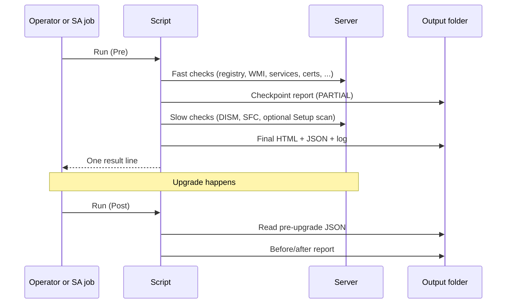
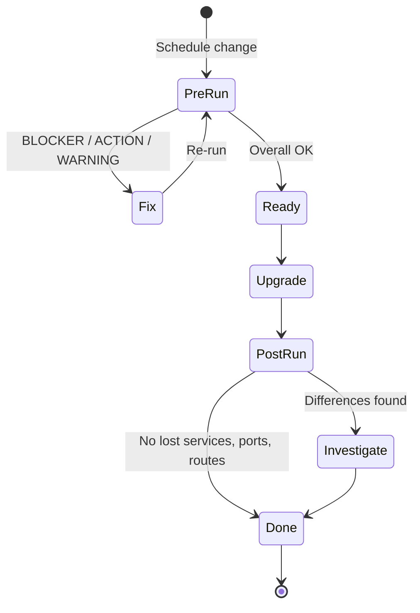
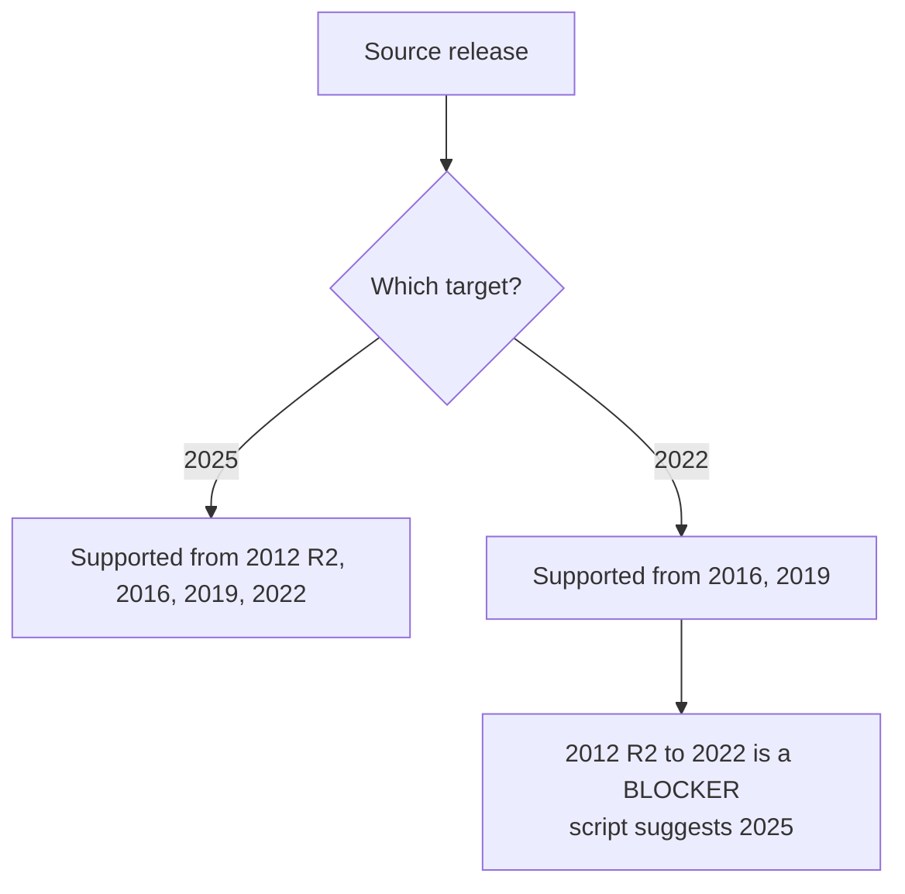
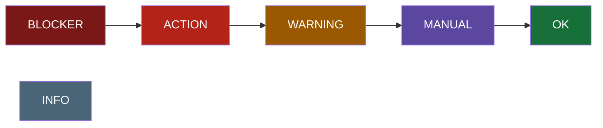
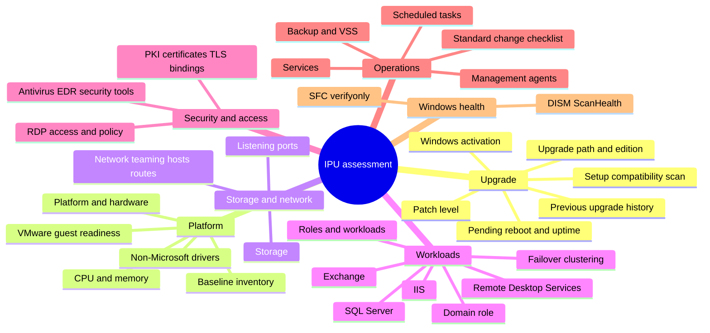
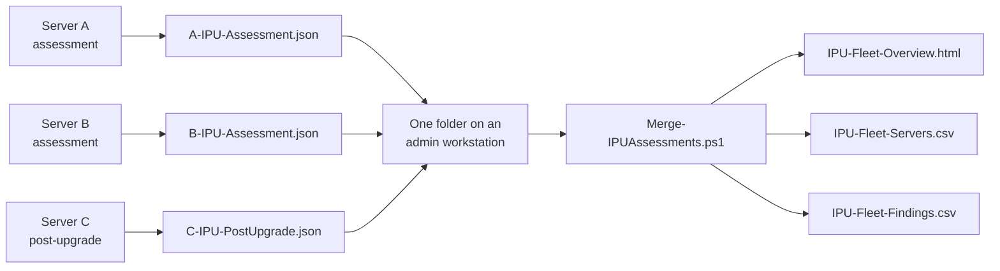
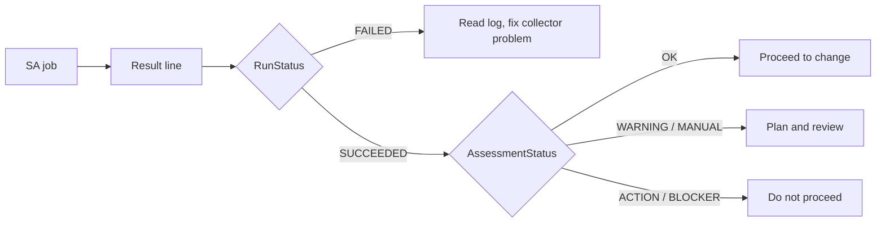

# User guide

How to run the Windows IPU readiness assessment, read its results, and troubleshoot it.

**Scripts:** `src/Windows-IPU-Readiness-Assessment.ps1` (collector version 4.2.0, runs on each server) and
`src/Merge-IPUAssessments.ps1` (version 1.0.4, combines many servers' results, runs on an admin workstation)
**Audience:** server and change engineers preparing or verifying a Windows Server in-place upgrade.

## Contents

1. [Overview](#1-overview)
2. [Requirements](#2-requirements)
3. [Running the assessment](#3-running-the-assessment)
4. [Parameters](#4-parameters)
5. [Outputs](#5-outputs)
6. [Reading the report](#6-reading-the-report)
7. [What is checked](#7-what-is-checked)
8. [Post-upgrade verification](#8-post-upgrade-verification)
9. [Combining many servers: fleet overview](#9-combining-many-servers-fleet-overview)
10. [Running from OpenText Server Automation](#10-running-from-opentext-server-automation)
11. [Safety and side effects](#11-safety-and-side-effects)
12. [Troubleshooting](#12-troubleshooting)
13. [Running the tests](#13-running-the-tests)

---

## 1. Overview

The script is a **read-only collector**. It gathers facts from the server, applies Microsoft's published
upgrade rules plus project thresholds, and writes a report. It never changes the server's configuration.



### Typical lifecycle



## 2. Requirements

| Item | Requirement |
|---|---|
| OS | Windows Server 2012 R2 or later (source) |
| PowerShell | Windows PowerShell 4.0 or later (the script has `#requires -Version 4.0`). Windows Server 2012 R2's own 4.0 is enough; CI checks every change against it |
| .NET Framework | 4.5 or later (2012 R2 with Windows PowerShell 4.0 always has it; 4.8 recommended) |
| Rights | Administrator. Normally runs as the SA Agent (LocalSystem) |
| Disk | Writable output folder (default `C:\Temp\IPU-Assessment`) |
| Optional | `LGPO.exe` at `C:\Temp\Tools\LGPO.exe` for a restorable local-policy backup |
| Optional | Target installation media (folder, UNC share or `.iso`) for Setup's own compatibility scan |

A 32-bit PowerShell host on 64-bit Windows is handled: the script relaunches itself in 64-bit PowerShell,
because the 32-bit view would give wrong registry and file results. If it cannot relaunch (no file path), it continues
and flags it in the report.

**Prerequisites check.** Before collecting anything, the script checks PowerShell 4.0 or later, .NET Framework 4.5 or later, and administrator rights. If one is missing, it stops at once, and the SA result line says `FAILED` with exactly what is missing and what to do. For example: `Missing: Administrator rights. Run the script elevated (Run as administrator), or as SYSTEM through OpenText SA.` The report contains the same text. If an optional PowerShell module is missing (Storage, NetAdapter, NetTCPIP, ScheduledTasks, ServerManager, Dism), the run continues, and a `MANUAL` row names the module and the checks it affects.

## 3. Running the assessment

Open an elevated PowerShell session on the server.

```powershell
# Default: pre-upgrade, target Windows Server 2025
.\Windows-IPU-Readiness-Assessment.ps1

# Target Windows Server 2022
.\Windows-IPU-Readiness-Assessment.ps1 -TargetServerVersion 2022

# Add Setup's compatibility scan using real media
.\Windows-IPU-Readiness-Assessment.ps1 -TargetMediaPath 'D:\' -TargetMediaLanguage 'en-US'

# After the upgrade
.\Windows-IPU-Readiness-Assessment.ps1 -AssessmentMode Post
```

If your machine enforces signed scripts and refuses to run it (`is not digitally signed`), either sign the
script or start PowerShell with a process-scoped bypass: `powershell -ExecutionPolicy Bypass -File .\...ps1`.
Do not change the machine-wide policy for this.

### Choosing a target



Anything else, including a clustered node (use a Cluster OS Rolling Upgrade) and, by company policy, a domain
controller (`-BlockDomainControllerIPU`), is reported as a `BLOCKER`.

## 4. Parameters

Parameters are validated before anything runs: thresholds and timeouts must be within sensible ranges (for example 1 to 2048 GB for `MinimumCFreeGB`), paths must be absolute, and `TargetMediaLanguage` must look like a culture name such as `en-US`. An invalid value stops the script with an error and nothing is collected.

Every setting has a default, so the script runs unchanged when no arguments can be passed (such as an SA
ad-hoc job). Override only what you need.

### Scope

| Parameter | Default | Meaning |
|---|---|---|
| `TargetServerVersion` | `2025` | Destination release: `2025` or `2022` |
| `AssessmentMode` | `Pre` | `Pre` = before the upgrade. `Post` = verify and compare with the Pre result |
| `TargetMediaPath` | blank | Folder/drive with `setup.exe`, UNC share, or `.iso`. Blank skips the Setup compatibility scan |
| `TargetMediaLanguage` | blank | Language of the target ISO, for example `en-US`. Blank = the report tells you |
| `BlockDomainControllerIPU` | `$true` | Company policy: domain controllers are replaced side by side, not upgraded in place |

### Thresholds

These are project values, not Microsoft minimums (unless noted).

| Parameter | Default | Meaning |
|---|---|---|
| `MinimumCFreeGB` | 40 | Free space target on C:. Below it, an `ACTION` finding recommends extending C: |
| `ExtendBlockGB` | 10 | Step size for that recommendation: the shortfall is rounded up to a multiple of this (for example 12 GB short with a 10 GB step recommends 20 GB) |
| `MinimumMemoryGB` | 8 | Below this, a `WARNING` recommends adding memory |
| `MaxPatchAgeDays` | 60 | Warn when the last patch is older |
| `UptimeWarningDays` | 60 | Warn on long uptime (a reboot is overdue) |
| `GroupPolicyMaxAgeDays` | 7 | Domain members: warn when Group Policy has not applied for longer |
| `AVMaxAgeDays` | 3 | Warn when antivirus signatures are older |
| `CertificateWarningDays` | 90 | Warn on certificates expiring sooner |
| `SystemPartitionMinFreeMB` | 50 | Minimum free space on the system partition |
| `RecoveryPartitionMinFreeMB` | 250 | Minimum free space on the recovery partition (Microsoft WinRE guidance) |

### Slow checks (time-boxed)

| Parameter | Default | Meaning |
|---|---|---|
| `RunDISMScanHealth` | `$true` | Run `DISM /ScanHealth` (read-only) |
| `RunSFCVerifyOnly` | `$true` | Run `SFC /verifyonly` (read-only) |
| `DISMTimeoutMinutes` | 30 | Cap for the DISM scan |
| `SFCTimeoutMinutes` | 30 | Cap for the SFC scan |
| `SlowCheckBudgetMinutes` | 50 | One budget shared by DISM and SFC |
| `CompatScanTimeoutMinutes` | 45 | Added to the budget when `TargetMediaPath` is set |

When the budget runs out, remaining slow checks are reported as `MANUAL` (skipped), not silently dropped.

### RDP policy evidence

| Parameter | Default | Meaning |
|---|---|---|
| `EnableRDPPolicyEvidence` | `$true` | Collect RDP access and policy evidence |
| `LgpoExe` | `C:\Temp\Tools\LGPO.exe` | Optional. Used only for backup (`/b`) and `/parse` |
| `PolicyEvidenceRoot` | `C:\Temp\Tools\PolBackup` | Timestamped evidence folder and ZIP go here |
| `CreatePolicyEvidenceZip` | `$true` | Zip the evidence |
| `EnableIISConfigEvidence` | `$true` | When IIS is installed, copy its configuration files into a restricted evidence folder and ZIP under `PolicyEvidenceRoot` (see [IIS configuration copy](#iis-configuration-copy)) |

### Output

| Parameter | Default | Meaning |
|---|---|---|
| `ReportDirectory` | `C:\Temp\IPU-Assessment` | Where HTML, JSON and log are written |
| `WriteJson` | `$true` | Write the JSON result (also the post-upgrade baseline) |
| `RestrictOutputAcl` | `$true` | Folders the script creates (report folder, policy evidence) get access for SYSTEM and Administrators only. Existing folders are never changed; the report warns, with the `icacls` command to fix it, if an existing folder is readable by Everyone, Authenticated Users or Users. `$false` keeps inherited permissions |
| `NumberCultureName` | `da-DK` | Culture used to format numbers in the SA result line. Invalid values fall back to invariant |
| `RedactReport` | `$false` | Replace names, addresses, accounts, SIDs and certificate details with placeholders in the HTML and JSON, for sharing outside the team. See [Sharing a report: redaction](#sharing-a-report-redaction) |

### Site data files

| Parameter | Default | Meaning |
|---|---|---|
| `PatternFile` | blank | Optional JSON file that adds, replaces or disables detection patterns (products, services and drivers the script recognises). See [Site data files](#site-data-files-patterns-and-profile) |
| `ProfileFile` | blank | Optional JSON file with your site's defaults for the settings above. An argument given to the script still wins |

#### Site data files: patterns and profile

Both files are optional. Without them the script behaves exactly as before and writes no extra row. They let
you keep vendor names and site policy outside the script, so the script itself does not need editing when a
vendor renames a product or a site uses other thresholds. Keep them next to the script in SA, or on a share the
computer account can read, and pass the full path.

**All or nothing.** If a file cannot be read, is not valid JSON, has the wrong `Schema`, or contains any
invalid entry, *nothing* from that file is applied: the run uses the built-in values and the report shows a
`MANUAL` finding *Pattern file* or *Profile file* in *Assessment and Collector* with every problem found. When a
file is applied, an `INFO` row lists what it changed and the file's SHA-256, so the report shows which version
was used.

**Pattern file** (`"Schema": "IPU-Patterns/1"`). Top-level keys are the categories `Agents`,
`EndpointProtection`, `SecurityTools`, `Backup` and `Workloads` (see section 2 of the script for the built-in
entries). Each category is a list of entries:

| Field | Meaning |
|---|---|
| `Label` | Required. The name shown in the report. An entry with the same label as a built-in one (case does not matter) **replaces** it; a new label is **added** |
| `App` | Regular expression for the installed application name |
| `Service` | Regular expression for the service short name |
| `Display` | Regular expression for the service display name |
| `Driver` | Regular expression for a filter or kernel driver name |
| `Disabled` | `true` **removes** the built-in entry with this label |

An entry needs at least one of `App`, `Service`, `Display`, `Driver` (unless it disables). Patterns are matched
case-insensitively; keep them specific, because a broad word matches unrelated software.

```json
{
  "Schema": "IPU-Patterns/1",
  "EndpointProtection": [
    { "Label": "Contoso EDR", "App": "^Contoso EDR", "Service": "^CtsEdr$", "Driver": "^CtsEdrFlt$" }
  ],
  "Workloads": [
    { "Label": "Contoso ERP", "Service": "^CtsErp" },
    { "Label": "Boomi", "Disabled": true }
  ]
}
```

**Profile file** (`"Schema": "IPU-Profile/1"`). One object `Settings` with any of these parameters:
`TargetMediaLanguage`, `BlockDomainControllerIPU`, the thresholds, the slow-check settings, the RDP policy
evidence settings, `WriteJson`, `RestrictOutputAcl` and `NumberCultureName`. Each value must pass the same
checks as the parameter (range, type, absolute path). `AssessmentMode`, `TargetServerVersion`,
`TargetMediaPath`, `ReportDirectory`, `RedactReport` and the two file parameters describe one run and cannot
be set in a profile. Settings passed as arguments win; the *Profile file* row names them.

```json
{
  "Schema": "IPU-Profile/1",
  "Settings": {
    "MinimumCFreeGB": 60,
    "MaxPatchAgeDays": 45,
    "TargetMediaLanguage": "en-US",
    "NumberCultureName": "en-GB"
  }
}
```

Both examples are in [`docs/examples`](examples/). A JSON backslash must be doubled: `"C:\\Tools\\LGPO.exe"`.

## 5. Outputs

For computer `SRV01`:

| Mode | Files in `ReportDirectory` |
|---|---|
| Pre | `SRV01-IPU-Assessment.html`, `.json`, `.log` |
| Post | `SRV01-IPU-PostUpgrade.html`, `.json`, `.log` |

The report is written **twice**: a `PARTIAL` checkpoint after the fast checks, and the final report after the
slow checks. If the job is stopped early, the checkpoint still exists and is marked `PARTIAL`.
Files are written to a `.writing` temp name and renamed, so a half-written report is never left in place.

### The SA result line

One semicolon-delimited line follows a header on stdout:

```
ComputerName;RunStatus;AssessmentStatus;ReportPath;LogPath;ReportSizeKB;Records;Started;Completed;Duration;CollectorVersion;Message
```

| Field | Values |
|---|---|
| `RunStatus` | `SUCCEEDED` or `FAILED` (the collector itself, not the server's readiness) |
| `AssessmentStatus` | Overall: `BLOCKER`, `ACTION`, `WARNING`, `MANUAL`, `OK` |

Process exit code: `0` when the report was written, `1` when the collector failed. A `BLOCKER` assessment still
exits `0`; read `AssessmentStatus`.

### Sharing a report: redaction

Reports describe a server in detail. To share one outside the team (a vendor, a ticket, a public bug report),
run with `-RedactReport $true`. In the HTML and JSON, these are replaced with placeholders that stay the same
within one run (the same address is always `IP-3`):

| Replaced | Placeholder | Example |
|---|---|---|
| Computer name, FQDNs in the server's domain, KMS and other hosts in that domain | `HOST-n` | `srv01.corp.example.test` |
| Domain name and NetBIOS domain | `DOMAIN-n` | `corp.example.test`, `CORP` |
| IPv4 and IPv6 addresses (not masks, `127.0.0.1`, `0.0.0.0`, `::1`) | `IP-n` | `10.20.30.40`, `fe80::1c2d:...` |
| MAC addresses | `MAC-n` | `00:50:56:AB:CD:EF` |
| Accounts: `DOMAIN\user`, `user@domain`, local group members | `ACCOUNT-n` | `CORP\svc_batch` |
| Domain SIDs (well-known SIDs such as `S-1-5-32-544` are kept) | `SID-n` | `S-1-5-21-...-500` |
| Certificate thumbprints and subject/issuer names | `CERT-n`, `NAME-n` | `CN=srv01.corp...` |

Kept: well-known accounts (`BUILTIN\...`, `NT AUTHORITY\...`), versions, file and registry paths, product
names, ports.

> **Redaction is best effort.** It recognises the patterns above and the names it knows (this server and its
> domain). A host name from another domain, a name inside free text, or an unusual format can stay visible.
> **Read a redacted report before you share it.**

What changes with redaction:

- The HTML and JSON are named `REDACTED-<yyyyMMdd-HHmmss>-IPU-Assessment.*` (or `-IPU-PostUpgrade.*`), so the
  file name does not reveal the server. The SA result line keeps the real computer name, and the log is **not**
  redacted (it stays on the server).
- The JSON has `"Redacted": true`. A redacted result **cannot** be the post-upgrade baseline: placeholders cannot
  be compared with the real server, and the post-upgrade run says so. Keep a normal (unredacted) pre-upgrade run
  for the comparison and redact a second run, or only the copies you share.
- The placeholder mapping is never written to any file.
- The fleet overview shows each redacted file as its own row, marked `redacted`.

### JSON shape

Schema id `IPU-Assessment/1`. Top-level keys: `CollectorVersion`, `ComputerName`, `Mode`, `TargetServerVersion`,
`Started`, `Completed`, `Partial`, `Overall`, `Counts`, `Facts`, `Results`, `CheckRuns`, `Snapshot`.
`Results[]` has `CheckId, Area, Item, Status, Kind, Value, Details, Recommendation, Source`.
`Snapshot` is what the post-upgrade run compares against. The fleet overview script (section 9) reads the same
files and accepts only `Schema` = `IPU-Assessment/1`. Every field is described in
[result-schema.md](result-schema.md); the formal JSON Schema is [result-schema.json](result-schema.json), and
[samples/sample-result.json](samples/sample-result.json) is an example.

## 6. Reading the report

### Status



Most severe on the left. The **overall status is the most severe *finding***.

| Status | Do this |
|---|---|
| `BLOCKER` | Resolve before scheduling. Examples: unsupported path, clustered node, domain controller, unsupported SQL/Exchange combination |
| `ACTION` | Complete as part of the change. Example: a feature that Setup will remove |
| `WARNING` | Plan for it. Example: stale patch level, long uptime |
| `MANUAL` | A person must check. Includes things a script cannot prove and **any check that failed to run** |
| `OK` | Checked and fine |
| `INFO` | Context only |

### Result kinds

| Kind | Affects overall? | Purpose |
|---|---|---|
| Finding | Yes | `BLOCKER`, `ACTION`, `WARNING`, `MANUAL` |
| Observation | No | Visible status without changing the verdict |
| Checklist | No | Standard change-procedure steps, listed separately |
| Evidence | No | Inventory and documentation |

### Report layout

- **Hero**: computer, target, times, collector version, overall badge.
- **Cards**: counts per finding status.
- **Counters**: the BLOCKER, ACTION, WARNING and MANUAL counters at the top are links to the rows behind them; *Checklist items* and *Checks run* link to the checklist and to *Collector coverage*.
- **Banners**: `PARTIAL REPORT` (slow checks unfinished) and `Not fully assessed` (a check failed, ran out of time, or was not started because the time budget was used up; the results for that area may be incomplete).
- **Commands and links**: many recommendations show the exact command for this server, labelled **Check** (read-only, safe to run any time) or **Change** (changes the server: run it in the change window, after reading it). The *Copy* button copies it; in print the command is shown as text. The script itself never runs these commands. Where the right action depends on a vendor, there is a *Read more* link to the official page instead. A setting that comes from Group Policy says so, because a local command would be overwritten: change the GPO.
- **Not run by choice** (grey note): a check that was switched off or needs something that was not given, for example the Setup compatibility scan without installation media. The note says what to do if you want it included. It is not a problem.
- **Findings table**: status, area, item, finding, **what to do**.
- **Chapters** (collapsible): one per area group, listed in section 7.
- **Collector coverage**: every check, its outcome and duration. Read this before trusting an empty area.

> If a check shows `Failed` or `Skipped`, an empty section is **not** evidence of readiness. Review it by hand.

## 7. What is checked

The [checks reference](checks.md) lists every check with what it looks at and the results it can produce.

33 checks. Fast checks run first; the three slow ones run after the checkpoint report.



| Chapter in the report | Covers |
|---|---|
| Upgrade Path, Licensing and Windows Health | Supported path, edition and media image, activation and KMS, DISM, SFC, Setup scan, upgrade history |
| Workloads and Applications | Exchange, SQL Server, domain role, roles and features, installed applications, removed or deprecated features |
| Hardware and Virtualization | Physical or virtual, VMware Tools and vSphere versions, non-Microsoft drivers, CPU and memory |
| Storage | Volumes, free space, system and recovery partitions |
| Clustering | Failover cluster membership |
| Network | Adapters and teaming, hosts file, static routes, listening ports |
| Access and Remote Desktop | RDP and NLA, local policy evidence |
| IIS and Remote Desktop Services | IIS, RDS roles |
| PKI and Certificates | CA role, certificates and TLS bindings |
| Security and Antivirus | AV and EDR (Defender, TrendAI/Deep Security, CrowdStrike, SentinelOne, ...), Sysmon, other tools |
| Management Agents | OpenText SA, Universal Discovery, Operations agents |
| Backup and Recovery | Commvault, IBM Spectrum Protect, Veeam, VSS writers |
| Services and Scheduled Tasks | Services of interest, non-Microsoft tasks |
| Assessment and Collector | Change checklist, collector coverage, metadata |

Detection of products is data-driven (a table of names, services and filter drivers near the top of the script),
so when a vendor renames a product you edit the table, not the logic.

### IIS configuration copy

When IIS is installed, the assessment copies the files in `%windir%\System32\inetsrv\config` (`applicationHost.config`,
`administration.config`, `redirection.config`, ...) into `<PolicyEvidenceRoot>\<Computer>-IPU-IIS-<time>` and zips it.
These are the files `appcmd add backup` saves. IIS itself is not touched. The folder gets SYSTEM and Administrators access
only, because `applicationHost.config` can contain encrypted passwords. The report shows where the copy is and the
SHA-256 of `applicationHost.config`.

The copy is from assessment time. **Immediately before the upgrade**, also run:

```
%windir%\system32\inetsrv\appcmd.exe add backup PreIPU
```

To restore from the assessment copy: stop IIS (`iisreset /stop`), copy the files back to `%windir%\System32\inetsrv\config`,
and start IIS again. Or copy them into a new folder under `%windir%\System32\inetsrv\backup` and run
`appcmd restore backup <folder name>`. If the server uses **shared configuration** (`redirection.config` points to a
share), the report says so: back up the files on that share as well.

### Standard change checklist

Always listed as `MANUAL` (cannot be proven from inside the guest): backup and fallback, credentials and console
access, target licensing, installation media, application owner sign-off, monitoring and management agents.

## 8. Post-upgrade verification

Run on the same server, with the same `ReportDirectory`, after the upgrade:

```powershell
.\Windows-IPU-Readiness-Assessment.ps1 -AssessmentMode Post
```

It reads `<Computer>-IPU-Assessment.json` from the pre-upgrade run and reports:

- whether the server reached the target release (`ACTION` if it did not, with the Setup log locations to read),
- differences in services, ports, routes, IP and DNS settings, hosts entries, applications, features and tasks.

If the pre-upgrade JSON is missing, you get a `MANUAL` finding and must compare by hand with the pre-upgrade
HTML. The checklist and Setup compatibility scan are skipped in Post mode.

> Keep the pre-upgrade `.json`. It is the baseline.

## 9. Combining many servers: fleet overview

`src/Merge-IPUAssessments.ps1` (version 1.0.4, for assessment 4.0.1 and later) reads the JSON result of every
server in a folder and writes **one overview** for the whole estate. It is read-only for the input files.



**Where it runs:** an admin workstation or jump host with Windows PowerShell 5.1 or PowerShell 7. **Not** on the
assessed servers. Collect the JSON files from the servers into one folder first (with the approved SA file-retrieval
process).

### Running it

```powershell
# Read every result in D:\IPU\Results; write the overview next to them
.\Merge-IPUAssessments.ps1 -InputFolder 'D:\IPU\Results'

# Separate output folder, pre-upgrade results only
.\Merge-IPUAssessments.ps1 -InputFolder 'D:\IPU\Results' -OutputFolder 'D:\IPU\Overview' -Mode Pre

# Comma-separated CSVs instead of semicolon
.\Merge-IPUAssessments.ps1 -InputFolder 'D:\IPU\Results' -Delimiter ','
```

| Parameter | Default | Meaning |
|---|---|---|
| `InputFolder` | required | Folder with the `*-IPU-Assessment.json` and `*-IPU-PostUpgrade.json` files |
| `OutputFolder` | the input folder | Where the three output files are written (created if missing) |
| `Mode` | `All` | `Pre`, `Post` or `All`: which kind of result to include |
| `Delimiter` | `;` | CSV separator. `;` opens in columns in Excel with Danish regional settings |

The console prints a one-line summary (`Servers`, `Findings`, `Unreadable files`) and the paths written.

### What it produces

| File | Contents |
|---|---|
| `IPU-Fleet-Overview.html` | Cards with overall counts, a **Servers (worst first)** table, the **most common BLOCKER/ACTION items** across the fleet with which servers have them, and a list of any files it could not read |
| `IPU-Fleet-Servers.csv` | One row per server and mode: `ComputerName`, `Mode`, `Overall`, `Blocker`, `Action`, `Warning`, `Manual`, `Target`, `CurrentOS`, `UpgradePath`, `InstallationMedia`, `Platform`, `DomainRole`, `SqlServer`, `CompatScan`, `CDrive`, `Activation`, `TopIssues`, `NotAssessed`, `Partial`, `Completed`, `CollectorVersion`, `SourceFile` |
| `IPU-Fleet-Findings.csv` | One row per BLOCKER, ACTION, WARNING or MANUAL finding: `ComputerName`, `Mode`, `Status`, `Area`, `Item`, `Value`, `Details`, `Recommendation`. Filter and pivot it in Excel |

### How it decides

- **Newest wins.** If a server has several results for the same mode, only the newest (by `Completed`) is used. A server can still appear twice, once for Pre and once for Post, when `Mode` is `All`.
- **Worst first.** Servers are sorted `BLOCKER`, `ACTION`, `WARNING`, `MANUAL`, `OK`, then by name.
- **`TopIssues`** lists the BLOCKER and ACTION findings for that server. **`NotAssessed`** lists checks that did not complete (skipped checks are not counted).
- **Partial results** are shown with a `partial` marker: the slow checks had not finished on that server.
- **Unreadable files** (not valid JSON, or a `Schema` other than `IPU-Assessment/1`) are listed in the report and skipped. They do not stop the run.
- If no matching files exist, the script stops with `No *-IPU-Assessment.json or *-IPU-PostUpgrade.json files found`.

> The overview and CSVs describe every server in detail. Treat them as sensitive and keep them out of shared
> locations.

## 10. Running from OpenText Server Automation

The script is designed for SA Ad-Hoc Scripting, normally as the SA Agent (LocalSystem).

1. Paste or attach the script. If your job can pass arguments, use them; otherwise edit the defaults in the `param()` block.
2. **Set the job timeout** above the slow-check budget:

   `SlowCheckBudgetMinutes` (+ `CompatScanTimeoutMinutes` when `TargetMediaPath` is set) **+ about 15 minutes.**
   With defaults that is roughly 65 minutes, or 110 with media.
3. Read the single result line from the job output (`RunStatus`, `AssessmentStatus`).
4. Retrieve the HTML through your approved SA file-retrieval process.



## 11. Safety and side effects

| Does | Does not |
|---|---|
| Write report, log, JSON and evidence files | Install, remove or reconfigure anything |
| `DISM /ScanHealth`, `SFC /verifyonly` | `DISM /RestoreHealth`, `SFC /scannow` |
| `LGPO.exe /b` and `/parse` (if present) | `LGPO.exe /g` or `/m` |
| With media only: mount and dismount an ISO; Setup's `/compat scanonly` creates `C:\$WINDOWS.~BT` | Start an upgrade |
| Query registry, WMI, services, certificates | Query `Win32_Product` (it triggers MSI reconfiguration) |

Reports contain a detailed inventory (ports, tasks, certificates, agents). Treat them as sensitive and restrict
access to the output folder.

## 12. Troubleshooting

| Symptom | Cause | Fix |
|---|---|---|
| `... is not digitally signed` | Machine enforces signed scripts | Sign the script, or `powershell -ExecutionPolicy Bypass -File` for that process only |
| Fleet overview: `No ... files found` | Wrong `InputFolder`, or the files were renamed | Files must end in `-IPU-Assessment.json` or `-IPU-PostUpgrade.json` |
| Fleet overview lists a file under "Files not read" | Corrupt JSON, or not an `IPU-Assessment/1` result | Re-collect the file from the server; check the collector version is 4.0.1 or later |
| Fleet CSV opens as one column in Excel | Regional list separator differs from `;` | Re-run with `-Delimiter ','` |
| Report says `PARTIAL REPORT` | Slow checks had not finished (job stopped or timed out) | Raise the SA job timeout above the budget (section 10) and re-run |
| `Not fully assessed: <check> stopped with an error` | A check hit an unexpected error | See `.log` for the message and line number; review that area manually |
| `Skipped - slow-check time budget used up` | DISM and SFC consumed the shared budget | Run manually, or raise `SlowCheckBudgetMinutes` and the job timeout |
| Application or SQL results look wrong | 32-bit PowerShell host without relaunch | Run from 64-bit PowerShell; the report flags this |
| No before/after comparison | Pre-upgrade JSON missing | Restore `<Computer>-IPU-Assessment.json` into the same folder |
| Source release not recognised | Unknown build number | Report shows `MANUAL`; check the OS build and caption |
| Wrong number formatting in the SA line | `NumberCultureName` | Set a valid culture, for example `en-US` |
| `HTML validation failed` | Report generation produced a truncated document | Re-run; attach the log |

Log lines are `Timestamp;Level;Phase;Message`. Each check logs `Started` and `Finished` with outcome and duration.

## 13. Running the tests

```powershell
Invoke-Pester .\tests -Output Detailed
```

Requires Pester 5. The tests load the script in library mode by setting `IPU_ASSESSMENT_LIBRARY_ONLY=1`, so
functions are defined but nothing is collected and nothing on the machine is touched. They cover the decision
rules (upgrade path, edition, SQL and VMware support, DISM/SFC/VSS verdicts), the result model, HTML and JSON
output and the post-upgrade comparison. The collection code inside each check is not yet covered; see
[the repository review](review/audit-review-Claude.md).
