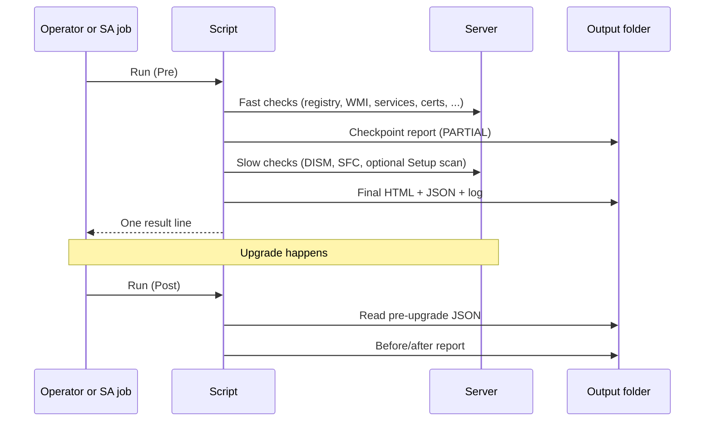
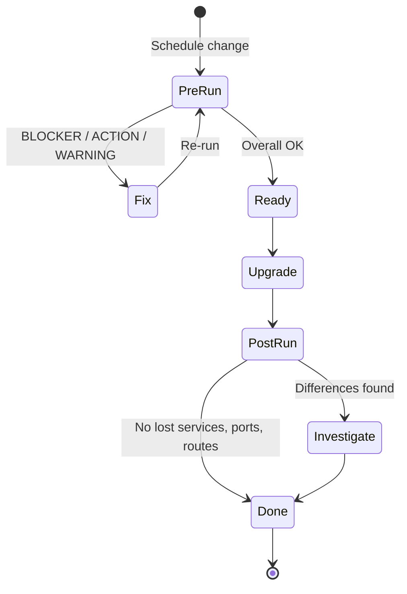
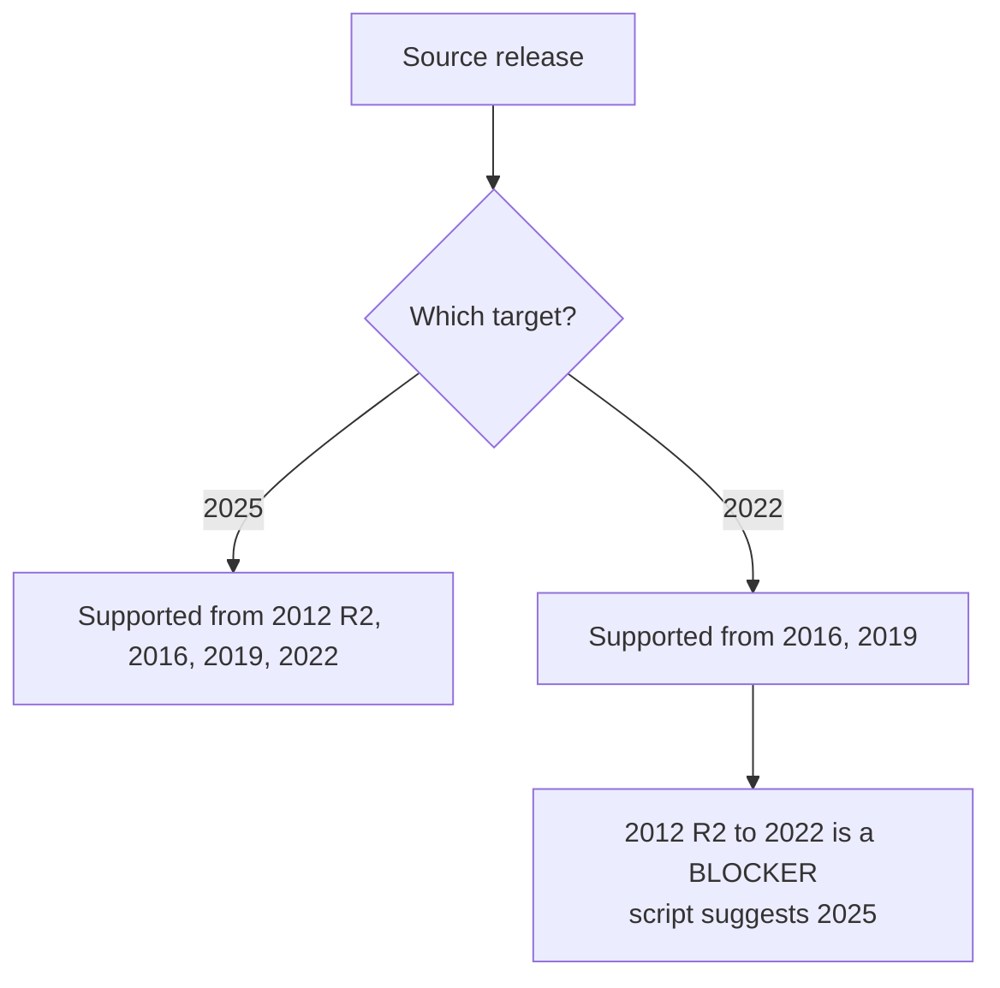
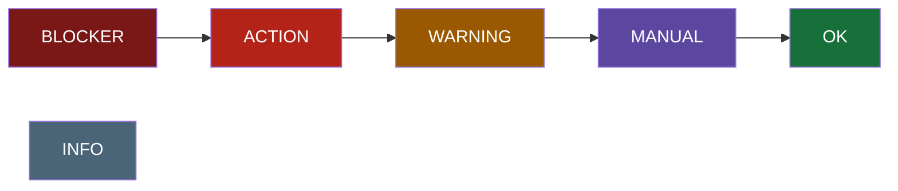
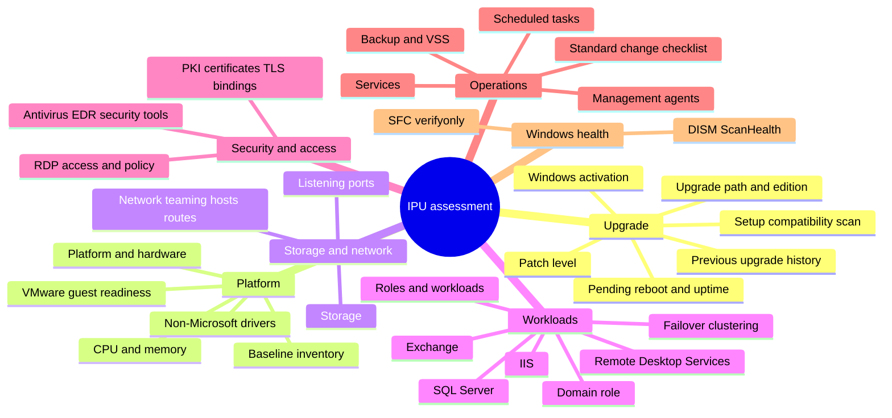
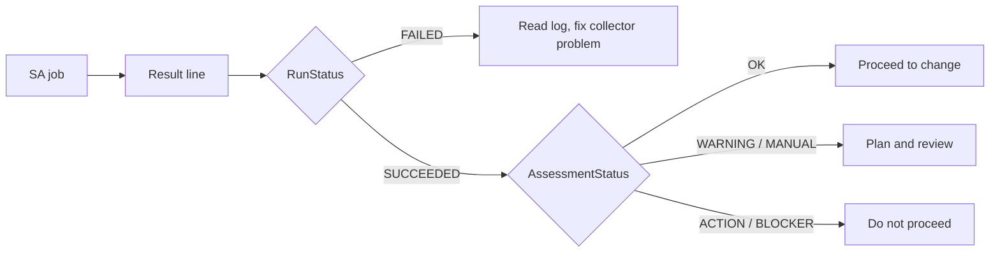

# User guide

How to run the Windows IPU readiness assessment, read its results, and troubleshoot it.

**Script:** `src/Windows-IPU-Readiness-Assessment.ps1` (collector version 4.0.1)
**Audience:** server and change engineers preparing or verifying a Windows Server in-place upgrade.

## Contents

1. [Overview](#1-overview)
2. [Requirements](#2-requirements)
3. [Running the assessment](#3-running-the-assessment)
4. [Parameters](#4-parameters)
5. [Outputs](#5-outputs)
6. [Reading the report](#6-reading-the-report)
7. [What is checked](#7-what-is-checked)
8. [Post-upgrade verification](#8-post-upgrade-verification)
9. [Running from OpenText Server Automation](#9-running-from-opentext-server-automation)
10. [Safety and side effects](#10-safety-and-side-effects)
11. [Troubleshooting](#11-troubleshooting)
12. [Running the tests](#12-running-the-tests)

---

## 1. Overview

The script is a **read-only collector**. It gathers facts from the server, applies Microsoft's published
upgrade rules plus project thresholds, and writes a report. It never changes the server's configuration.



### Typical lifecycle



## 2. Requirements

| Item | Requirement |
|---|---|
| OS | Windows Server 2012 R2 or later (source) |
| PowerShell | Windows PowerShell 4.0 or later (the script has `#requires -Version 4.0`) |
| Rights | Administrator. Normally runs as the SA Agent (LocalSystem) |
| Disk | Writable output folder (default `C:\Temp\IPU-Assessment`) |
| Optional | `LGPO.exe` at `C:\Temp\Tools\LGPO.exe` for a restorable local-policy backup |
| Optional | Target installation media (folder, UNC share or `.iso`) for Setup's own compatibility scan |

A 32-bit PowerShell host on 64-bit Windows is handled: the script relaunches itself in 64-bit PowerShell,
because the 32-bit view would give wrong registry and file results. If it cannot relaunch (no file path), it continues
and flags it in the report.

## 3. Running the assessment

Open an elevated PowerShell session on the server.

```powershell
# Default: pre-upgrade, target Windows Server 2025
.\Windows-IPU-Readiness-Assessment.ps1

# Target Windows Server 2022
.\Windows-IPU-Readiness-Assessment.ps1 -TargetServerVersion 2022

# Add Setup's compatibility scan using real media
.\Windows-IPU-Readiness-Assessment.ps1 -TargetMediaPath 'D:\' -TargetMediaLanguage 'en-US'

# After the upgrade
.\Windows-IPU-Readiness-Assessment.ps1 -AssessmentMode Post
```

If your machine enforces signed scripts and refuses to run it (`is not digitally signed`), either sign the
script or start PowerShell with a process-scoped bypass: `powershell -ExecutionPolicy Bypass -File .\...ps1`.
Do not change the machine-wide policy for this.

### Choosing a target



Anything else, including a clustered node (use a Cluster OS Rolling Upgrade) and, by company policy, a domain
controller (`-BlockDomainControllerIPU`), is reported as a `BLOCKER`.

## 4. Parameters

Every setting has a default, so the script runs unchanged when no arguments can be passed (such as an SA
ad-hoc job). Override only what you need.

### Scope

| Parameter | Default | Meaning |
|---|---|---|
| `TargetServerVersion` | `2025` | Destination release: `2025` or `2022` |
| `AssessmentMode` | `Pre` | `Pre` = before the upgrade. `Post` = verify and compare with the Pre result |
| `TargetMediaPath` | blank | Folder/drive with `setup.exe`, UNC share, or `.iso`. Blank skips the Setup compatibility scan |
| `TargetMediaLanguage` | blank | Language of the target ISO, for example `en-US`. Blank = the report tells you |
| `BlockDomainControllerIPU` | `$true` | Company policy: domain controllers are replaced side by side, not upgraded in place |

### Thresholds

These are project values, not Microsoft minimums (unless noted).

| Parameter | Default | Meaning |
|---|---|---|
| `MinimumCFreeGB` | 40 | Free space target on C:. Below it, an `ACTION` finding recommends extending C: |
| `ExtendBlockGB` | 10 | Step size for that recommendation: the shortfall is rounded up to a multiple of this (for example 12 GB short with a 10 GB step recommends 20 GB) |
| `MinimumMemoryGB` | 8 | Below this, a `WARNING` recommends adding memory |
| `MaxPatchAgeDays` | 60 | Warn when the last patch is older |
| `UptimeWarningDays` | 60 | Warn on long uptime (a reboot is overdue) |
| `AVMaxAgeDays` | 3 | Warn when antivirus signatures are older |
| `CertificateWarningDays` | 90 | Warn on certificates expiring sooner |
| `SystemPartitionMinFreeMB` | 50 | Minimum free space on the system partition |
| `RecoveryPartitionMinFreeMB` | 250 | Minimum free space on the recovery partition (Microsoft WinRE guidance) |

### Slow checks (time-boxed)

| Parameter | Default | Meaning |
|---|---|---|
| `RunDISMScanHealth` | `$true` | Run `DISM /ScanHealth` (read-only) |
| `RunSFCVerifyOnly` | `$true` | Run `SFC /verifyonly` (read-only) |
| `DISMTimeoutMinutes` | 30 | Cap for the DISM scan |
| `SFCTimeoutMinutes` | 30 | Cap for the SFC scan |
| `SlowCheckBudgetMinutes` | 50 | One budget shared by DISM and SFC |
| `CompatScanTimeoutMinutes` | 45 | Added to the budget when `TargetMediaPath` is set |

When the budget runs out, remaining slow checks are reported as `MANUAL` (skipped), not silently dropped.

### RDP policy evidence

| Parameter | Default | Meaning |
|---|---|---|
| `EnableRDPPolicyEvidence` | `$true` | Collect RDP access and policy evidence |
| `LgpoExe` | `C:\Temp\Tools\LGPO.exe` | Optional. Used only for backup (`/b`) and `/parse` |
| `PolicyEvidenceRoot` | `C:\Temp\Tools\PolBackup` | Timestamped evidence folder and ZIP go here |
| `CreatePolicyEvidenceZip` | `$true` | Zip the evidence |

### Output

| Parameter | Default | Meaning |
|---|---|---|
| `ReportDirectory` | `C:\Temp\IPU-Assessment` | Where HTML, JSON and log are written |
| `WriteJson` | `$true` | Write the JSON result (also the post-upgrade baseline) |
| `NumberCultureName` | `da-DK` | Culture used to format numbers in the SA result line. Invalid values fall back to invariant |

## 5. Outputs

For computer `SRV01`:

| Mode | Files in `ReportDirectory` |
|---|---|
| Pre | `SRV01-IPU-Assessment.html`, `.json`, `.log` |
| Post | `SRV01-IPU-PostUpgrade.html`, `.json`, `.log` |

The report is written **twice**: a `PARTIAL` checkpoint after the fast checks, and the final report after the
slow checks. If the job is stopped early, the checkpoint still exists and is marked `PARTIAL`.
Files are written to a `.writing` temp name and renamed, so a half-written report is never left in place.

### The SA result line

One semicolon-delimited line follows a header on stdout:

```
ComputerName;RunStatus;AssessmentStatus;ReportPath;LogPath;ReportSizeKB;Records;Started;Completed;Duration;CollectorVersion;Message
```

| Field | Values |
|---|---|
| `RunStatus` | `SUCCEEDED` or `FAILED` (the collector itself, not the server's readiness) |
| `AssessmentStatus` | Overall: `BLOCKER`, `ACTION`, `WARNING`, `MANUAL`, `OK` |

Process exit code: `0` when the report was written, `1` when the collector failed. A `BLOCKER` assessment still
exits `0`; read `AssessmentStatus`.

### JSON shape

Schema id `IPU-Assessment/1`. Top-level keys: `CollectorVersion`, `ComputerName`, `Mode`, `TargetServerVersion`,
`Started`, `Completed`, `Partial`, `Overall`, `Counts`, `Facts`, `Results`, `CheckRuns`, `Snapshot`.
`Results[]` has `CheckId, Area, Item, Status, Kind, Value, Details, Recommendation, Source`.
`Snapshot` is what the post-upgrade run compares against.

## 6. Reading the report

### Status



Most severe on the left. The **overall status is the most severe *finding***.

| Status | Do this |
|---|---|
| `BLOCKER` | Resolve before scheduling. Examples: unsupported path, clustered node, domain controller, unsupported SQL/Exchange combination |
| `ACTION` | Complete as part of the change. Example: a feature that Setup will remove |
| `WARNING` | Plan for it. Example: stale patch level, long uptime |
| `MANUAL` | A person must check. Includes things a script cannot prove and **any check that failed to run** |
| `OK` | Checked and fine |
| `INFO` | Context only |

### Result kinds

| Kind | Affects overall? | Purpose |
|---|---|---|
| Finding | Yes | `BLOCKER`, `ACTION`, `WARNING`, `MANUAL` |
| Observation | No | Visible status without changing the verdict |
| Checklist | No | Standard change-procedure steps, listed separately |
| Evidence | No | Inventory and documentation |

### Report layout

- **Hero**: computer, target, times, collector version, overall badge.
- **Cards**: counts per finding status.
- **Banners**: `PARTIAL REPORT` (slow checks unfinished) and `Not fully assessed` (a check failed or was skipped).
- **Findings table**: status, area, item, finding, **what to do**.
- **Chapters** (collapsible): one per area group, listed in section 7.
- **Collector coverage**: every check, its outcome and duration. Read this before trusting an empty area.

> If a check shows `Failed` or `Skipped`, an empty section is **not** evidence of readiness. Review it by hand.

## 7. What is checked

33 checks. Fast checks run first; the three slow ones run after the checkpoint report.



| Chapter in the report | Covers |
|---|---|
| Upgrade Path, Licensing and Windows Health | Supported path, edition and media image, activation and KMS, DISM, SFC, Setup scan, upgrade history |
| Workloads and Applications | Exchange, SQL Server, domain role, roles and features, installed applications, removed or deprecated features |
| Hardware and Virtualization | Physical or virtual, VMware Tools and vSphere versions, non-Microsoft drivers, CPU and memory |
| Storage | Volumes, free space, system and recovery partitions |
| Clustering | Failover cluster membership |
| Network | Adapters and teaming, hosts file, static routes, listening ports |
| Access and Remote Desktop | RDP and NLA, local policy evidence |
| IIS and Remote Desktop Services | IIS, RDS roles |
| PKI and Certificates | CA role, certificates and TLS bindings |
| Security and Antivirus | AV and EDR (Defender, TrendAI/Deep Security, CrowdStrike, SentinelOne, ...), Sysmon, other tools |
| Management Agents | OpenText SA, Universal Discovery, Operations agents |
| Backup and Recovery | Commvault, IBM Spectrum Protect, Veeam, VSS writers |
| Services and Scheduled Tasks | Services of interest, non-Microsoft tasks |
| Assessment and Collector | Change checklist, collector coverage, metadata |

Detection of products is data-driven (a table of names, services and filter drivers near the top of the script),
so when a vendor renames a product you edit the table, not the logic.

### Standard change checklist

Always listed as `MANUAL` (cannot be proven from inside the guest): backup and fallback, credentials and console
access, target licensing, installation media, application owner sign-off, monitoring and management agents.

## 8. Post-upgrade verification

Run on the same server, with the same `ReportDirectory`, after the upgrade:

```powershell
.\Windows-IPU-Readiness-Assessment.ps1 -AssessmentMode Post
```

It reads `<Computer>-IPU-Assessment.json` from the pre-upgrade run and reports:

- whether the server reached the target release (`ACTION` if it did not, with the Setup log locations to read),
- differences in services, ports, routes, IP and DNS settings, hosts entries, applications, features and tasks.

If the pre-upgrade JSON is missing, you get a `MANUAL` finding and must compare by hand with the pre-upgrade
HTML. The checklist and Setup compatibility scan are skipped in Post mode.

> Keep the pre-upgrade `.json`. It is the baseline.

## 9. Running from OpenText Server Automation

The script is designed for SA Ad-Hoc Scripting, normally as the SA Agent (LocalSystem).

1. Paste or attach the script. If your job can pass arguments, use them; otherwise edit the defaults in the `param()` block.
2. **Set the job timeout** above the slow-check budget:

   `SlowCheckBudgetMinutes` (+ `CompatScanTimeoutMinutes` when `TargetMediaPath` is set) **+ about 15 minutes.**
   With defaults that is roughly 65 minutes, or 110 with media.
3. Read the single result line from the job output (`RunStatus`, `AssessmentStatus`).
4. Retrieve the HTML through your approved SA file-retrieval process.



## 10. Safety and side effects

| Does | Does not |
|---|---|
| Write report, log, JSON and evidence files | Install, remove or reconfigure anything |
| `DISM /ScanHealth`, `SFC /verifyonly` | `DISM /RestoreHealth`, `SFC /scannow` |
| `LGPO.exe /b` and `/parse` (if present) | `LGPO.exe /g` or `/m` |
| With media only: mount and dismount an ISO; Setup's `/compat scanonly` creates `C:\$WINDOWS.~BT` | Start an upgrade |
| Query registry, WMI, services, certificates | Query `Win32_Product` (it triggers MSI reconfiguration) |

Reports contain a detailed inventory (ports, tasks, certificates, agents). Treat them as sensitive and restrict
access to the output folder.

## 11. Troubleshooting

| Symptom | Cause | Fix |
|---|---|---|
| `... is not digitally signed` | Machine enforces signed scripts | Sign the script, or `powershell -ExecutionPolicy Bypass -File` for that process only |
| Report says `PARTIAL REPORT` | Slow checks had not finished (job stopped or timed out) | Raise the SA job timeout above the budget (section 9) and re-run |
| `Not fully assessed: <check> (Failed)` | A check hit an unexpected error | See `.log` for the message and line number; review that area manually |
| `Skipped - slow-check time budget used up` | DISM and SFC consumed the shared budget | Run manually, or raise `SlowCheckBudgetMinutes` and the job timeout |
| Application or SQL results look wrong | 32-bit PowerShell host without relaunch | Run from 64-bit PowerShell; the report flags this |
| No before/after comparison | Pre-upgrade JSON missing | Restore `<Computer>-IPU-Assessment.json` into the same folder |
| Source release not recognised | Unknown build number | Report shows `MANUAL`; check the OS build and caption |
| Wrong number formatting in the SA line | `NumberCultureName` | Set a valid culture, for example `en-US` |
| `HTML validation failed` | Report generation produced a truncated document | Re-run; attach the log |

Log lines are `Timestamp;Level;Phase;Message`. Each check logs `Started` and `Finished` with outcome and duration.

## 12. Running the tests

```powershell
Invoke-Pester .\tests -Output Detailed
```

Requires Pester 5. The tests load the script in library mode by setting `IPU_ASSESSMENT_LIBRARY_ONLY=1`, so
functions are defined but nothing is collected and nothing on the machine is touched. They cover the decision
rules (upgrade path, edition, SQL and VMware support, DISM/SFC/VSS verdicts), the result model, HTML and JSON
output and the post-upgrade comparison. The collection code inside each check is not yet covered; see
[the repository review](review/audit-review-Claude.md).
